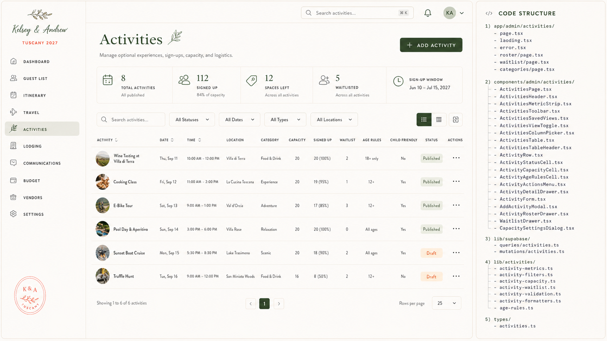

# Admin Spec — Activities

> **Status:** Captured 2026-07-20 — **not yet built.** Source: bundled "Claude Code Implementation
> Brief — Admin Activities Page" (brief 1 of 4) + approved mockup.
> **Maps to:** net-new page `/admin/activities`. No admin activities page exists today (the guest
> site has a public `/activities` route; this is the admin operations counterpart).
> **Repo reconciliation (read before building):** brief assumes Tailwind + TanStack + RHF/Zod +
> direct Supabase reads; this repo uses **CSS Modules** + **Supabase RPCs** (`admin_*`) under
> `app/admin/(dashboard)/`. The mockup's right-hand **"Code Structure" panel** lists the brief's
> intended file tree (`components/admin/activities/*`, `lib/supabase/queries|mutations/activities`,
> `lib/activities/*`, `types/activities.ts`) — adapt those paths/stack to the repo's conventions.
> Age-rule / child-eligibility logic here overlaps the Settings adult/child-age config — keep them
> consistent.

## Mockup reference



- **Header:** title "Activities"; subtitle "Manage optional experiences, sign-ups, capacity, and
  logistics."; **+ ADD ACTIVITY** button; top bar has a global search + notifications + account.
- **Metric strip (5):** `8 Total Activities` (All published) · `112 Signed Up` (84% of capacity) ·
  `12 Spaces Left` (Across all activities) · `5 Waitlisted` · `Sign-up Window Jun 10 – Jul 15, 2027`.
- **Toolbar:** Search activities… · All Statuses · All Dates · All Types · All Locations · list/grid
  view toggle · column/layout control.
- **Table columns:** Activity (thumb + name) · Date · Time · Location · Category · Capacity ·
  Signed Up · Waitlist · Age Rules · Child Friendly · Status · Actions.
- **Sample rows:** Wine Tasting at Villa di Terra (Thu Sep 11, 10:00 AM–12:00 PM, Villa di Terra,
  Food & Drink, cap 20, 20 (100%), waitlist 2, **18+ only**, child No, **Published**) · Cooking
  Class (Fri Sep 12, La Cucina Toscana, Experience, 19 (95%), 12+, Published) · E-Bike Tour (Sat
  Sep 13, Val d'Orcia, Adventure, 17 (85%), 12+, Published) · Pool Day & Aperitivo (Sun Sep 14,
  Villa Rose, Relaxation, 20 (100%), All ages, Published) · Sunset Boat Cruise (Mon Sep 15, Lake
  Trasimeno, Scenic, 18 (90%), All ages, **Draft**) · Truffle Hunt (Tue Sep 16, San Miniato Woods,
  Food & Drink, 8 (50%), 12+, Draft).
- **Pagination:** "Showing 1 to 6 of 6 activities" · Rows per page 25.

> ⚠️ **Wedding-fact note:** mockup uses **September 2027** dates; canonical is **June 16–21, 2027 ·
> Tuscany**. Reconcile on build. See `docs/admin/README.md`.

---
## 1. CLAUDE CODE IMPLEMENTATION BRIEF

### Admin Activities Page

Build the Activities section of the private wedding-planning admin interface.

Primary route:

```
/admin/activities
```

The page must recreate the approved Activities mockup while using the existing:

Admin shell and left sidebar

Design tokens and typography

Shared page-title and metric-strip components

Guest and party records

Adult/child classification rules

Wedding events and itinerary records

Travel and transportation records

Supabase project

URL-based filters

Drawer, dialog, table, and form patterns

The page must function as the central workspace for optional activities, sign-ups, capacity, waitlists, eligibility, and activity logistics.

### A. Route structure

Create:

```
app/
  admin/
    activities/
      page.tsx
      loading.tsx
      error.tsx

      roster/
        page.tsx

      waitlist/
        page.tsx

      categories/
        page.tsx
```

Use /admin/activities with URL state for the primary views:

```
/admin/activities
/admin/activities?view=table
/admin/activities?view=cards
/admin/activities?status=published
/admin/activities?capacity=full
/admin/activities?waitlist=has-waitlist
/admin/activities?childFriendly=true
```

Supported URL parameters:

view

search

status

date

type

location

capacity

waitlist

ageRule

childFriendly

sort

page

pageSize

columns

Do not recreate the admin shell locally.

### B. Component structure

Create:

```
components/
  admin/
    activities/
      ActivitiesPage.tsx
      ActivitiesHeader.tsx
      ActivitiesMetricStrip.tsx
      ActivitiesToolbar.tsx
      ActivitiesSavedViews.tsx
      ActivitiesViewToggle.tsx
      ActivitiesColumnPicker.tsx

      ActivitiesTable.tsx
      ActivitiesTableHeader.tsx
      ActivityRow.tsx
      ActivityNameCell.tsx
      ActivityCapacityCell.tsx
      ActivityWaitlistCell.tsx
      ActivityAgeRulesCell.tsx
      ActivityChildFriendlyCell.tsx
      ActivityStatusCell.tsx
      ActivityActionsMenu.tsx

      ActivitiesCardGrid.tsx
      ActivityCard.tsx

      ActivityDetailDrawer.tsx
      ActivityOverviewTab.tsx
      ActivityRosterTab.tsx
      ActivityWaitlistTab.tsx
      ActivityLogisticsTab.tsx
      ActivityHistoryTab.tsx

      ActivityForm.tsx
      AddActivityModal.tsx
      DeleteActivityDialog.tsx
      DuplicateActivityDialog.tsx

      ActivityRosterDrawer.tsx
      ActivityRosterTable.tsx
      AddGuestToActivityDialog.tsx
      RemoveGuestFromActivityDialog.tsx
      MoveGuestActivityDialog.tsx

      WaitlistDrawer.tsx
      WaitlistTable.tsx
      PromoteWaitlistGuestDialog.tsx

      CapacitySettingsDialog.tsx
      AgeRulesEditor.tsx
      ActivityEligibilityPreview.tsx
      ActivityTransportationSection.tsx
      ActivityDietarySummary.tsx

      ActivitiesPagination.tsx
      ActivitiesEmptyState.tsx
```

Create:

```
types/
  activities.ts
```

Add:

```
lib/
  supabase/
    queries/
      activities.ts
    mutations/
      activities.ts

  activities/
    activity-metrics.ts
    activity-capacity.ts
    activity-waitlist.ts
    activity-eligibility.ts
    activity-age-rules.ts
    activity-filters.ts
    activity-status.ts
    activity-validation.ts
    activity-formatters.ts
```

Reuse shared buttons, inputs, filters, tables, dialogs, menus, and drawers.

### C. Page header

Display:

Activities

Manage optional experiences, sign-ups, capacity, and logistics.

Primary action:

+ Add Activity

Use the same forest-green action button as the other admin pages.

### D. Summary metric strip

Use five metrics:

8 Total Activities

All published and draft activities

112 Signed Up

84% of total capacity

12 Spaces Left

Across all open activities

5 Waitlisted

Across all activities

Sign-Up Window

Jun 10 – Jul 15, 2027

Type:

```
export interface ActivitiesMetrics {
  totalActivityCount: number;
  publishedActivityCount: number;
  draftActivityCount: number;

  totalCapacity: number;
  signedUpCount: number;
  capacityPercentage: number;

  spacesRemainingCount: number;
  waitlistedCount: number;

  signupOpensAt?: string | null;
  signupClosesAt?: string | null;
  signupWindowOpen: boolean;
}
```

Click behavior:

Total Activities → clear filters

Signed Up → sort by signed-up count

Spaces Left → filter to available activities

Waitlisted → filter to activities with waitlists

Sign-Up Window → open activity settings

The Signed Up total must count individual guests, not parties.

### E. Toolbar and saved views

Primary toolbar:

Search activities…

All Statuses

All Dates

All Types

All Locations

Table View | Card View

Columns

Saved views beneath or integrated into filters:

All Activities

Published

Drafts

Nearly Full

Full

Has Waitlist

Child Friendly

Age Restricted

Search fields:

Activity title

Location

Category

Vendor

Guest name in roster

Description

### F. Activities table

Columns:

Activity

Date

Time

Location

Category

Capacity

Signed Up

Waitlist

Age Rules

Child Friendly

Status

Actions

Recommended widths:

Activity: 230px

Date: 105px

Time: 145px

Location: 160px

Category: 130px

Capacity: 85px

Signed Up: 105px

Waitlist: 80px

Age Rules: 100px

Child Friendly: 105px

Status: 100px

Actions: 52px

Minimum width:

Approximately 1350px

Rows should be approximately 74–84px tall.

### G. Activity cell

Display:

[thumbnail] Wine Tasting at Villa di Terra

Optional secondary line:

Food & Drink

Thumbnail:

44px × 44px

Circular or softly rounded

Object-cover

Clicking the title opens the detail drawer.

### H. Capacity and signed-up logic

Display:

Capacity

30

Signed Up

28 (93%)

Waitlist

2

Capacity states:

Available

Nearly Full

Full

Over Capacity

Unlimited

Suggested thresholds:

```
export function getCapacityState(
  signedUp: number,
  capacity: number | null
): ActivityCapacityState {
  if (capacity == null) return 'unlimited';
  if (signedUp > capacity) return 'over_capacity';
  if (signedUp === capacity) return 'full';
  if (signedUp / capacity >= 0.85) return 'nearly_full';
  return 'available';
}
```

Use forest for available, gold for nearly full, and terracotta for full or over capacity.

### I. Age rules and child eligibility

Support:

All ages

18+ only

12+

Children 6+

Adults only

Custom

Do not rely only on a childFriendly boolean.

Each activity may define:

```
export interface ActivityAgeRule {
  ruleType:
    | 'all_ages'
    | 'adults_only'
    | 'minimum_age'
    | 'allowed_categories'
    | 'custom';

  minimumAge?: number | null;
  allowedAgeCategories?: GuestAgeCategory[];
  adultAccompanimentRequired: boolean;
  customLabel?: string | null;
}
```

Age eligibility must use the Guest & RSVP settings and each guest’s calculated age category or manual override.

Child-friendly display:

Yes

No

With adult

Age dependent

Clicking the age rule should show a tooltip or eligibility preview.

### J. Activity roster

The detail drawer’s Roster tab must show:

Guest

Party

Adult/Child Category

Age

Booking Status

Booked At

Dietary Notes

Transportation

Actions

Booking statuses:

Booked

Waitlisted

Cancelled

Pending

Admin Added

Roster actions:

Add guest

Remove guest

Move to waitlist

Move to another activity

Cancel booking

Export roster

Send message

Display roster totals:

28 booked

2 waitlisted

4 children

24 adults

3 dietary notes

7 transportation requests

### K. Waitlist behavior

Support settings:

No waitlist

Automatic waitlist

Manual approval waitlist

Allow overbooking

Promotion flow:

Spot becomes available

→ First eligible waitlisted guest is suggested

→ Admin promotes guest

→ Guest receives confirmation when communications are enabled

Do not auto-promote guests if:

Age eligibility no longer matches

Party-member requirements conflict

Required adult accompaniment is missing

Guest has a conflicting activity

Capacity depends on equipment or transport subtype

### L. Activity detail drawer

Width:

620px–700px

Tabs:

Overview

Roster

Waitlist

Logistics

History

#### Overview

Fields:

Title

Category

Public description

Admin description

Date

Start/end time

Location

Related itinerary event

Capacity

Booking status

Signup opening/closing dates

Age rules

Child-friendly status

Image

Vendor

Cost per guest

Guest price, if any

Visibility

Publication status

#### Logistics

Show:

Transportation required

Pickup location

Pickup time

Drop-off location

Equipment requirements

Waiver required

Dietary collection

What to bring

Dress guidance

Vendor

Internal notes

### M. Add/Edit Activity form

Use React Hook Form and Zod.

const activityFormSchema = z

```
  .object({
    title: z.string().min(1),
    categoryId: z.string().uuid().nullable().optional(),
    description: z.string().max(1200).optional(),
    adminNotes: z.string().max(3000).optional(),

    startsAt: z.string(),
    endsAt: z.string(),

    locationId: z.string().uuid().nullable().optional(),
    eventId: z.string().uuid().nullable().optional(),
    vendorId: z.string().uuid().nullable().optional(),

    capacity: z.number().int().positive().nullable(),
    waitlistMode: z.enum([
      'none',
      'automatic',
      'manual',
      'allow_overbooking',
    ]),

    status: z.enum([
      'draft',
      'published',
      'closed',
      'cancelled',
      'completed',
    ]),

    signupOpensAt: z.string().nullable().optional(),
    signupClosesAt: z.string().nullable().optional(),

    ageRuleType: z.enum([
      'all_ages',
      'adults_only',
      'minimum_age',
      'allowed_categories',
      'custom',
    ]),

    minimumAge: z.number().min(0).nullable().optional(),
    adultAccompanimentRequired: z.boolean(),

    transportationRequired: z.boolean(),
    waiverRequired: z.boolean(),
    collectDietaryNotes: z.boolean(),
  })
  .refine(
    data => new Date(data.endsAt) > new Date(data.startsAt),
    {
      path: ['endsAt'],
      message: 'End time must be after start time.',
    }
  );
```

### N. Database model

Extend or create:

```
create table if not exists activities (
  id uuid primary key default gen_random_uuid(),
  title text not null,
  description text,
  admin_notes text,

  category_id uuid,
  event_id uuid references wedding_events(id) on delete set null,
  location_id uuid references event_locations(id) on delete set null,
  vendor_id uuid,

  starts_at timestamptz,
  ends_at timestamptz,

  capacity integer,
  waitlist_mode text not null default 'automatic',

  signup_opens_at timestamptz,
  signup_closes_at timestamptz,

  status text not null default 'draft',
  visibility text not null default 'invited_guests',

  age_rule_type text not null default 'all_ages',
  minimum_age integer,
  allowed_age_categories text[],
  adult_accompaniment_required boolean not null default false,

  transportation_required boolean not null default false,
  waiver_required boolean not null default false,
  collect_dietary_notes boolean not null default false,

  image_path text,
  sort_order integer not null default 0,

  created_at timestamptz not null default now(),
  updated_at timestamptz not null default now()
);
```

Bookings:

```
create table if not exists activity_bookings (
  id uuid primary key default gen_random_uuid(),

  activity_id uuid not null
    references activities(id)
    on delete cascade,

  guest_id uuid not null
    references guests(id)
    on delete cascade,

  status text not null default 'booked',
  source text not null default 'guest',

  waitlist_position integer,
  booked_at timestamptz,
  cancelled_at timestamptz,

  guest_notes text,
  admin_notes text,

  created_at timestamptz not null default now(),
  updated_at timestamptz not null default now(),

  unique(activity_id, guest_id)
);
```

### O. Activity conflicts

Automatically flag:

Guest booked into overlapping activities

Child does not meet minimum age

Child requires accompaniment but no adult party member is booked

Activity over capacity

Waitlist order missing

Transportation required but guest travel is incomplete

Cancelled guest still booked

Activity date conflicts with declined itinerary event

Create:

```
lib/activities/activity-conflicts.ts
```

### P. Acceptance criteria

The Activities page is complete when:

Activities show without opening each record

Capacity, bookings, waitlist, age rules, and status are visible

Adult/child eligibility uses central guest classification

Rosters show every booked guest

Waitlist promotion works

Activity conflicts are identified

Sign-ups from the guest site update the same records

Table and card views use the same data

Filters persist in the URL

Dashboard metrics and guest records update automatically

Styling matches the approved Activities mockup

