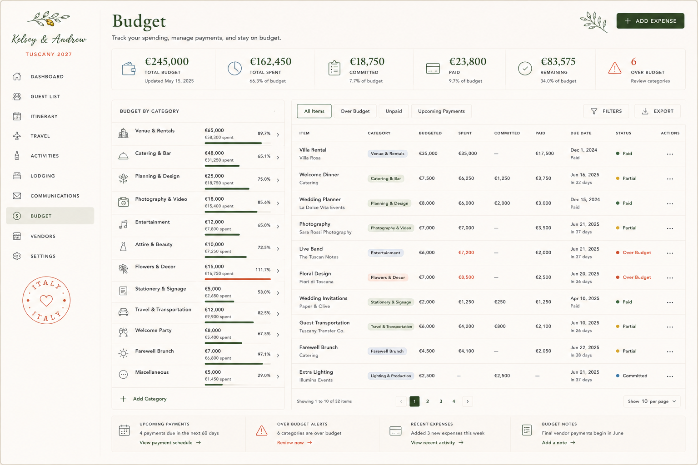

# Admin Spec — Budget

> **Status:** Captured 2026-07-20; **built 2026-07-21** (`app/admin/(dashboard)/budget/`).
> Source: "Claude Code Implementation Brief — Admin Budget Page" + approved mockup.
>
> **What was built:** the mockup's two-column layout (category panel left, item table right), a
> six-metric strip, tabs All Items · Over Budget · Unpaid · Upcoming Payments, the four money
> columns (Budgeted · Spent · Committed · Paid), `budget_categories` with per-category budgets and
> over-budget bars, and a **payment schedule** per line in a drawer — deposit, balance, mark paid.
>
> **The money model (D18):** `paid` and `status` are **derived**, never stored. Paid is the sum of
> `budget_payments` actually paid; status is computed in `admin_get_budget`. They used to be columns
> you could type a number into while the payments underneath said something else. A budget line can
> also be attached to a vendor, which is how the Vendors page reports spend without a second copy.
>
> **Not built:** document storage against a budget line, and **Gmail ingest** (its own unbuilt
> spec). The mockup's four footer cards were dropped: each one just switches to a tab that is
> already one click away in the tab row.
> **Maps to:** existing **Budget** page `app/admin/(dashboard)/budget/` (`BudgetManager.tsx`,
> `POST /api/admin/budget/items`, `budget/settings`, RPCs `admin_get_budget`,
> `admin_upsert_budget_item`, `admin_delete_budget_item`, `admin_set_budget_settings`). This brief
> is a **richer redesign** of that page (category panel, per-item committed/paid split, payment
> schedule, over-budget alerts, document storage, Gmail ingest).
> **Repo reconciliation (read before building):** brief assumes Tailwind + TanStack + direct
> Supabase reads and a fuller `budget_items` / `budget_categories` / `budget_payments` model; the
> current repo has a simpler `BudgetItem` (name, estimated_amount, amount_paid, due_date, status)
> behind RPCs, CSS Modules, and the `(dashboard)` route group. Extend the existing RPC surface
> rather than switching to direct table reads. Keep the layout, columns, calc rules, and states.

## Mockup reference (transcribed)



- **Header:** title "Budget"; subtitle "Track your spending, manage payments, and stay on budget.";
  olive sprig upper-right; **+ ADD EXPENSE** button.
- **Metric strip (6, EUR):** `€245,000 Total Budget` (Updated May 15, 2025) · `€162,450 Total
  Spent` (66.3% of budget) · `€18,750 Committed` (7.7%) · `€23,800 Paid` (9.7%) · `€83,575
  Remaining` (34.0%) · `6 Over Budget` (Review categories).
- **Left "Budget by Category" panel** (name · budgeted / spent · % bar): Venue & Rentals
  €65,000 / €58,300 (89.7%) · Catering & Bar €48,000 / €31,250 (65.1%) · Planning & Design
  €25,000 / €18,750 (75.0%) · Photography & Video €18,000 / €15,400 (85.6%) · Entertainment
  €12,000 / €7,800 (65.0%) · Attire & Beauty €10,000 / €7,250 (72.5%) · **Flowers & Decor
  €15,000 / €16,750 (111.7%, over)** · Stationery & Signage €5,000 / €2,650 (53.0%) · Travel &
  Transportation €12,000 / €9,900 (82.5%) · Welcome Party €8,000 / €5,400 (67.5%) · Farewell Brunch
  €7,000 / €6,800 (97.1%) · Miscellaneous €5,000 / €1,450 (29.0%) · + Add Category.
- **Right table** — tabs All Items / Over Budget / Unpaid / Upcoming Payments; Filters · Export.
  Columns: Item, Category, Budgeted, Spent, Committed, Paid, Due Date, Status, Actions. Sample rows:
  Villa Rental (Villa Rosa · Venue & Rentals · €35,000 / €35,000 / — / €17,500 · Dec 1 2024 ·
  **Paid**); Welcome Dinner (Catering · €7,500 / €6,250 / €1,250 / €3,750 · Jun 16 2025 ·
  **Partial**); Wedding Planner (La Dolce Vita Events · Paid); Photography (Sara Rossi · Partial);
  **Live Band (The Tuscan Notes · €6,000 / €7,200 · Over Budget)**; **Floral Design (Fiori di
  Toscana · €7,000 / €8,500 · Over Budget)**; Wedding Invitations (Paper & Olive · Paid); Guest
  Transportation (Tuscany Transfer Co. · Partial); Farewell Brunch (Partial); Extra Lighting
  (Illumina Events · **Committed**).
- **Bottom cards (4):** Upcoming Payments (4 due in next 60 days) · Over Budget Alerts (6 categories)
  · Recent Expenses (3 new this week) · Budget Notes ("Final vendor payments begin in June").
- **Pagination:** "Showing 1 to 10 of 32 items" · pages 1–4 · Show 10 per page.

> Note: mockup mixes 2024/2025 due dates and "May 15, 2025" — clearly placeholder data. Currency is
> **EUR (€)** throughout. Reconcile dates/currency to the real wedding on build.

---
## CLAUDE CODE IMPLEMENTATION BRIEF

### Admin Budget Page

Build the next page in the private wedding-planning admin interface:

```
/admin/budget
```

The page must recreate the approved Budget admin mockup as closely as possible while using the existing:

Admin application shell

Persistent left sidebar

Typography and design tokens

Shared metric-strip components

Shared table, filter, modal, drawer, and menu patterns

Supabase project

Vendor records

Event and itinerary records

Existing activity log

URL-based filter state

This page should function as the central financial management workspace for the wedding.

It must support:

Overall wedding budget tracking

Category-level budgets

Vendor and expense line items

Contracted or committed amounts

Payments and due dates

Remaining balances

Over-budget alerts

Upcoming-payment tracking

Notes and attachments

Event and vendor associations

Currency handling

Audit history

Dashboard synchronization

Do not build this as a decorative spending summary only. It must be a functional financial operations page.

## 1. ROUTE STRUCTURE

Create:

```
app/
  admin/
    budget/
      page.tsx
      loading.tsx
      error.tsx
```

Primary route:

```
/admin/budget
```

Use URL search parameters for page state:

```
/admin/budget?view=all
/admin/budget?view=over-budget
/admin/budget?view=unpaid
/admin/budget?view=upcoming
/admin/budget?category=venue-rentals
/admin/budget?status=partial
```

Supported parameters:

view

search

category

status

paymentStatus

vendor

event

dueWindow

sort

page

pageSize

columns

Do not recreate the sidebar or admin shell inside this route.

Use:

```
app/admin/layout.tsx
```

## 2. PAGE COMPONENT STRUCTURE

Create:

```
components/
  admin/
    budget/
      BudgetPageHeader.tsx
      BudgetMetricStrip.tsx
      BudgetWorkspace.tsx

      BudgetCategoryPanel.tsx
      BudgetCategoryRow.tsx
      BudgetCategoryProgress.tsx
      AddBudgetCategoryDialog.tsx
      EditBudgetCategoryDialog.tsx

      BudgetToolbar.tsx
      BudgetSavedViews.tsx
      BudgetFilterDrawer.tsx
      BudgetColumnPicker.tsx
      BudgetExportMenu.tsx

      BudgetTable.tsx
      BudgetTableHeader.tsx
      BudgetRow.tsx
      BudgetItemCell.tsx
      BudgetCategoryCell.tsx
      BudgetAmountCell.tsx
      BudgetDueDateCell.tsx
      BudgetStatusCell.tsx
      BudgetActionsMenu.tsx

      ExpenseDetailDrawer.tsx
      ExpenseForm.tsx
      AddExpenseModal.tsx
      RecordPaymentDialog.tsx
      PaymentSchedule.tsx
      PaymentHistory.tsx
      ExpenseAttachmentList.tsx
      ExpenseNotes.tsx

      UpcomingPaymentsCard.tsx
      OverBudgetAlertsCard.tsx
      RecentExpensesCard.tsx
      BudgetNotesCard.tsx

      BudgetPagination.tsx
      BudgetEmptyState.tsx
      BudgetLoadingSkeleton.tsx
```

Create or extend:

```
types/
  budget.ts
```

Add:

```
lib/
  supabase/
    queries/
      budget.ts
    mutations/
      budget.ts

  budget/
    budget-metrics.ts
    budget-status.ts
    budget-filters.ts
    budget-calculations.ts
    budget-validation.ts
    budget-formatters.ts
    budget-alerts.ts
    currency.ts
```

Reuse these existing shared components:

PageTitle

SummaryMetricStrip

SummaryMetricCard

SearchField

SegmentedControl

FilterDropdown

StatusBadge

AttentionBadge

OverflowMenu

LoadingSkeleton

EmptyState

ConfirmationDialog

Do not duplicate generic shared components.

## 3. PAGE HEADER

Display:

Title:

Budget

Subtitle:

Track your spending, manage payments, and stay on budget.

Primary action:

+ Add Expense

Example:

```
<PageTitle
  title="Budget"
  subtitle="Track your spending, manage payments, and stay on budget."
  action={
    <Button onClick={() => setAddExpenseOpen(true)}>
      <Plus className="size-4" />
      Add Expense
    </Button>
  }
```

/>

Retain:

Editorial forest-green page title

Warm cream page background

Small olive-branch decoration near the upper right

Existing dark forest-green primary-button style

Existing admin page padding and spacing

## 4. PAGE LAYOUT

Use this vertical structure:

Page header

Budget summary metric strip

Main workspace:

  Left: Budget by Category panel

  Right: Budget line-item workspace

Bottom operational cards

Expense detail drawer and modals

Desktop workspace:

```
grid-template-columns: 380px minmax(0, 1fr);
gap: 16px;
```

Recommended JSX:

```
<div className="space-y-4">
  <BudgetPageHeader />

  <BudgetMetricStrip metrics={metrics} />

  <div className="grid grid-cols-[380px_minmax(0,1fr)] gap-4">
    <BudgetCategoryPanel
      categories={categories}
      activeCategoryId={filters.categoryId}
    />

    <BudgetWorkspace
      rows={rows}
      filters={filters}
      pagination={pagination}
    />
  </div>

  <BudgetOperationalCards
    upcomingPayments={upcomingPayments}
    overBudgetCount={metrics.overBudgetCategoryCount}
    recentExpenses={recentExpenses}
    budgetNotes={budgetNotes}
  />
</div>
```

The category panel and table should align at their top and feel like one connected workspace.

## 5. SUMMARY METRIC STRIP

The approved mockup includes six metrics:

€245,000

Total Budget

Updated May 15, 2025

€162,450

Total Spent

66.3% of budget

€18,750

Committed

7.7% of budget

€23,800

Paid

9.7% of budget

€83,575

Remaining

34.0% of budget

6

Over Budget

Review categories

All values must come from Supabase.

Do not hardcode mockup numbers.

### TypeScript interface

```
export interface BudgetMetrics {
  currencyCode: string;

  totalBudget: number;
  totalSpent: number;
  totalCommitted: number;
  totalPaid: number;
  totalRemaining: number;

  spentPercentage: number;
  committedPercentage: number;
  paidPercentage: number;
  remainingPercentage: number;

  overBudgetCategoryCount: number;
  lastUpdatedAt?: string | null;
}
```

### Metric definitions

Use these calculation rules:

Total Budget

= Sum of active category budget amounts

Total Spent

= Sum of expense actual amounts already incurred

Committed

= Contracted or approved amounts not yet counted as fully paid

Paid

= Sum of recorded payments

Remaining

= Total Budget - Total Spent

Over Budget

= Count of categories where spent > budgeted

Do not define committed as simply all unpaid money. It represents financial obligations that have been contracted or approved.

### Suggested icons

Total Budget: WalletCards

Total Spent: PieChart

Committed: ClipboardList

Paid: CreditCard

Remaining: CircleCheck

Over Budget: TriangleAlert

### Color usage

Total Budget: forest

Total Spent: sky blue

Committed: sage

Paid: forest

Remaining: forest

Over Budget: terracotta

Metric cards should remain part of one connected horizontal strip.

Click behavior:

Total Budget

→ reset filters

Total Spent

→ sort by spent descending

Committed

→ filter to committed expenses

Paid

→ filter to paid

Remaining

→ show categories with remaining balance

Over Budget

→ filter to over-budget items/categories

## 6. CURRENCY HANDLING

The approved mockup uses euros.

Do not hardcode the euro symbol inside individual components.

Store a budget-level currency:

EUR

Use Intl.NumberFormat.

Example:

```
export function formatCurrency(
  value: number,
  currencyCode = 'EUR',
  locale = 'en-US'
): string {
  return new Intl.NumberFormat(locale, {
    style: 'currency',
    currency: currencyCode,
    maximumFractionDigits: 0,
  }).format(value);
}
```

The system should support future use of:

EUR

USD

GBP

For the initial wedding project, default to:

EUR

Do not silently combine mixed currencies.

If an expense is entered in another currency, store:

Original amount

Original currency

Converted amount

Budget currency

Exchange rate

Conversion date

## 7. BUDGET CATEGORY PANEL

The left panel title is:

BUDGET BY CATEGORY

Display one row per category.

Approved example categories:

Venue & Rentals

Catering & Bar

Planning & Design

Photography & Video

Entertainment

Attire & Beauty

Flowers & Decor

Stationery & Signage

Travel & Transportation

Welcome Party

Farewell Brunch

Miscellaneous

Each row includes:

Thin category icon

Category name

Budgeted amount

Spent amount

Spent percentage

Horizontal progress bar

Chevron

Example:

Venue & Rentals

€65,000

€58,300 spent

89.7%

### Suggested category icons

Venue & Rentals: Landmark

Catering & Bar: ConciergeBell

Planning & Design: Sprout

Photography & Video: Camera

Entertainment: Music2

Attire & Beauty: Shirt

Flowers & Decor: Flower2

Stationery & Signage: NotebookTabs

Travel & Transportation: CarFront

Welcome Party: Wine

Farewell Brunch: Sun

Miscellaneous: CircleEllipsis

Use Lucide icons initially.

### Category progress colors

0%–79%:

forest

80%–99%:

gold or darker sage

100% and above:

terracotta

Example:

```
export function getBudgetProgressTone(
  percentage: number
): 'safe' | 'warning' | 'over' {
  if (percentage >= 100) return 'over';
  if (percentage >= 80) return 'warning';
  return 'safe';
}
```

### Category selection

Clicking a category applies:

```
/admin/budget?category=<category-slug>
```

The selected row should have:

Very light forest background

Slightly stronger left indicator or border

Forest text

Clicking it again may clear the filter.

### Add category

Bottom row:

+ Add Category

Opens AddBudgetCategoryDialog.

Do not navigate away.

## 8. BUDGET WORKSPACE TOOLBAR

At the top of the right-side workspace, show saved views on the left:

All Items

Over Budget

Unpaid

Upcoming Payments

On the right:

Filters

Export

Suggested layout:

```
<div className="flex items-center justify-between gap-4">
  <BudgetSavedViews activeView={filters.view} />

  <div className="flex items-center gap-2">
    <Button variant="secondary">
      <ListFilter className="size-4" />
      Filters
    </Button>

    <BudgetExportMenu />
  </div>
</div>
```

### URL mappings

All Items

```
/admin/budget?view=all
```

Over Budget

```
/admin/budget?view=over-budget
```

Unpaid

```
/admin/budget?view=unpaid
```

Upcoming Payments

```
/admin/budget?view=upcoming
```

The saved views should be compact rectangular controls, not oversized pills.

## 9. SEARCH AND FILTERS

The mockup emphasizes saved views, but the Filter button should open a drawer or popover containing:

Search item, vendor, or category

Category

Vendor

Event

Expense status

Payment status

Due-date range

Over-budget only

Has attachment

Has contract

Currency

Amount range

Recommended filter state:

```
export interface BudgetPageFilters {
  view: 'all' | 'over-budget' | 'unpaid' | 'upcoming';
  search?: string;
  categoryId?: string;
  vendorId?: string;
  eventId?: string;
  expenseStatus?: BudgetExpenseStatus;
  paymentStatus?: BudgetPaymentStatus;
  dueWindow?: 'overdue' | 'next-30-days' | 'next-60-days';
  overBudgetOnly?: boolean;
  hasAttachment?: boolean;
  sort?: BudgetSortOption;
  page: number;
  pageSize: number;
}
```

Apply active filters in URL parameters.

Show a small count on the Filter button when filters are active:

Filters 3

## 10. BUDGET TABLE STRUCTURE

Use these columns:

Item

Category

Budgeted

Spent

Committed

Paid

Due Date

Status

Actions

Recommended widths:

Item: 225px

Category: 150px

Budgeted: 105px

Spent: 105px

Committed: 105px

Paid: 105px

Due Date: 125px

Status: 115px

Actions: 52px

Minimum workspace table width:

Approximately 1120px

The right workspace may scroll horizontally on narrower displays.

Use:

Warm-white surface

Small uppercase headers

Fine beige horizontal rules

Selective vertical separators

Row height approximately 72–82px

No zebra striping

No heavy card border around each row

## 11. ITEM CELL

Display:

Villa Rental

Villa Rosa

The primary line is the budget-item name.

The secondary line should usually be:

Vendor name

Property name

Payee

Event name when no vendor exists

Examples:

Welcome Dinner

Catering

Wedding Planner

La Dolce Vita Events

Photography

Sara Rossi Photography

Guest Transportation

Tuscany Transfer Co.

Clicking the primary name opens ExpenseDetailDrawer.

Clicking the secondary vendor name opens the vendor detail drawer if one exists.

## 12. CATEGORY CELL

Display a small softly colored category label.

Examples:

Venue & Rentals

Catering & Bar

Planning & Design

Photography & Video

Entertainment

Flowers & Decor

Stationery & Signage

Travel & Transportation

Farewell Brunch

Use muted category fills:

Venue & Rentals:

soft sky-gray

Catering & Bar:

soft sage

Planning & Design:

soft olive

Photography & Video:

soft cream-gray

Entertainment:

soft blue

Flowers & Decor:

soft terracotta

Stationery & Signage:

soft sage

Travel & Transportation:

soft forest-gray

Do not use saturated rainbow colors.

Category labels should be small and restrained.

## 13. AMOUNT COLUMNS

Use right-aligned tabular numerals.

Columns:

Budgeted

Spent

Committed

Paid

Example:

€35,000

€35,000

—

€17,500

Use:

```
font-variant-numeric: tabular-nums;
```

### Over-budget amount

When spent exceeds budgeted:

€7,200

Use terracotta text.

Do not color all normal values.

### Empty amount

Display:

—

Do not display €0 when the field has no meaningful value.

## 14. DUE DATE CELL

Display:

Jun 18, 2025

In 32 days

Other states:

Dec 1, 2024

Paid

May 1, 2025

Overdue by 14 days

—

No due date

Suggested date tone:

Paid:

muted neutral

Due within 30 days:

gold

Overdue:

terracotta

Future:

neutral

Create:

```
export interface BudgetDueDateState {
  dueDate?: string | null;
  label: string;
  supportingText: string;
  tone: 'neutral' | 'upcoming' | 'overdue' | 'paid';
}
```

## 15. STATUS CELL

Support:

Draft

Estimated

Committed

Partial

Paid

Over Budget

Cancelled

Refunded

Recommended meanings:

Draft:

Item exists but is not finalized

Estimated:

Budget estimate only

Committed:

Contract or approved obligation exists

Partial:

One or more payments made, balance remains

Paid:

Balance is fully paid

Over Budget:

Actual or committed total exceeds budgeted amount

Cancelled:

Expense is no longer active

Refunded:

Paid amount was partially or fully refunded

### Status colors

Paid:

forest

Partial:

gold

Committed:

sky blue

Estimated:

neutral gray

Draft:

neutral gray

Over Budget:

terracotta

Cancelled:

muted terracotta-gray

Refunded:

sage or blue-gray

Display:

```
<div className="flex items-center gap-2">
  <span className="size-2 rounded-full bg-forest-700" />
  <span>Paid</span>
</div>
```

Do not use large filled status pills.

### Derived status

The system may derive a visual status from payment and amount data, but preserve an explicit lifecycle status separately.

Example:

```
export function deriveExpenseDisplayStatus(
  item: BudgetItemSummary
): BudgetDisplayStatus {
  if (item.lifecycleStatus === 'cancelled') return 'cancelled';

  if (item.spentAmount > item.budgetedAmount) {
    return 'over_budget';
  }

  if (item.balanceDue <= 0 && item.paidAmount > 0) {
    return 'paid';
  }

  if (item.paidAmount > 0 && item.balanceDue > 0) {
    return 'partial';
  }

  if (item.committedAmount > 0) {
    return 'committed';
  }

  return item.lifecycleStatus === 'draft'
    ? 'draft'
    : 'estimated';
}
```

## 16. ACTIONS MENU

Each row has a three-dot menu.

Actions:

View details

Edit expense

Record payment

View payment schedule

Attach contract or invoice

Add note

Duplicate item

Move to category

Link vendor

Link event

Mark committed

Mark paid

Archive item

Delete item

Contextual behavior:

Record payment

Only available when balance remains

Mark paid

Only available when unpaid balance remains

Link vendor

Only available when no vendor is linked

Delete

Requires confirmation

Prefer archive over delete when:

Payments exist

Attachments exist

Vendor records are linked

History exists

## 17. SAMPLE TABLE DATA

Seed rows representing the mockup states.

### Paid venue item

Villa Rental

Villa Rosa

Venue & Rentals

Budgeted €35,000

Spent €35,000

Committed —

Paid €17,500

Due Dec 1, 2024

Paid

### Partial catering item

Welcome Dinner

Catering

Catering & Bar

Budgeted €7,500

Spent €6,250

Committed €1,250

Paid €3,750

Due Jun 18, 2025

Partial

### Paid planning item

Wedding Planner

La Dolce Vita Events

Planning & Design

Budgeted €8,000

Spent €6,000

Committed €2,000

Paid €3,000

Paid

### Partial photography item

Photography

Sara Rossi Photography

Photography & Video

Budgeted €7,000

Spent €7,000

Committed —

Paid €3,500

Due Jun 21, 2025

Partial

### Over-budget band

Live Band

The Tuscan Notes

Entertainment

Budgeted €6,000

Spent €7,200

Paid €2,000

Over Budget

### Over-budget floral item

Floral Design

Fiori di Toscana

Flowers & Decor

Budgeted €7,000

Spent €8,500

Paid €2,500

Over Budget

### Paid invitations

Wedding Invitations

Paper & Olive

Stationery & Signage

Budgeted €2,000

Spent €1,250

Committed €250

Paid €1,250

Paid

### Partial transportation

Guest Transportation

Tuscany Transfer Co.

Travel & Transportation

Budgeted €6,000

Spent €4,200

Committed €800

Paid €2,100

Partial

### Partial farewell brunch

Farewell Brunch

Catering

Farewell Brunch

Budgeted €4,500

Spent €4,100

Paid €2,050

Partial

### Committed lighting

Extra Lighting

Illumina Events

Lighting & Production

Budgeted €2,500

Spent —

Committed €2,500

Paid —

Committed

## 18. EXPENSE DETAIL DRAWER

Clicking a row opens a right-side drawer.

Recommended width:

620px to 700px

Tabs:

Overview

Payments

Documents

Notes

History

### Overview tab

Display and edit:

Item name

Category

Vendor

Related event

Budgeted amount

Estimated amount

Committed amount

Actual spent

Paid amount

Remaining balance

Expense status

Contract status

Due date

Currency

Tax

Gratuity or service charge

Admin notes

### Payments tab

Display:

Payment schedule

Payments made

Upcoming installments

Overdue payments

Refunds

Payment method

Confirmation/reference number

Actions:

Record payment

Edit payment

Delete payment

Mark scheduled payment complete

### Documents tab

Support:

Contracts

Invoices

Quotes

Receipts

Payment confirmations

Vendor proposals

Other attachments

### Notes tab

Support:

General budget notes

Negotiation notes

Vendor-specific notes

Payment instructions

Internal-only notes

### History tab

Show:

Expense created

Budget changed

Vendor linked

Contract attached

Payment scheduled

Payment recorded

Amount updated

Expense moved category

Status changed

## 19. ADD OR EDIT EXPENSE FORM

Use React Hook Form and Zod.

Form sections:

Expense details

Category and vendor

Amounts

Payment schedule

Event association

Documents

Notes

Suggested schema:

const budgetExpenseFormSchema = z

```
  .object({
    title: z.string().min(1, 'Expense name is required'),

    categoryId: z.string().uuid(),
    vendorId: z.string().uuid().nullable().optional(),
    eventId: z.string().uuid().nullable().optional(),

    budgetedAmount: z.number().min(0),
    estimatedAmount: z.number().min(0).optional(),
    committedAmount: z.number().min(0).optional(),
    actualAmount: z.number().min(0).optional(),

    originalCurrency: z.string().length(3),
    budgetCurrency: z.string().length(3),

    exchangeRate: z.number().positive().optional(),
    exchangeRateDate: z.string().optional(),

    dueDate: z.string().nullable().optional(),

    lifecycleStatus: z.enum([
      'draft',
      'estimated',
      'approved',
      'committed',
      'cancelled',
    ]),

    contractStatus: z
      .enum([
        'none',
        'requested',
        'received',
        'reviewing',
        'signed',
      ])
      .optional(),

    taxAmount: z.number().min(0).optional(),
    serviceChargeAmount: z.number().min(0).optional(),
    gratuityAmount: z.number().min(0).optional(),

    notes: z.string().max(3000).optional(),
  })
  .refine(
    data =>
      data.originalCurrency === data.budgetCurrency ||
      Boolean(data.exchangeRate),
    {
      message:
        'An exchange rate is required when currencies differ.',
      path: ['exchangeRate'],
    }
  );
```

Primary actions:

Save Draft

Save Expense

Cancel

For an existing item:

Save Changes

## 20. RECORD PAYMENT DIALOG

Create:

```
RecordPaymentDialog.tsx
```

Fields:

Expense

Payment amount

Payment date

Payment status

Payment method

Payee

Reference number

Original currency

Converted amount

Exchange rate

Notes

Receipt attachment

Payment statuses:

scheduled

processing

paid

failed

cancelled

refunded

partially_refunded

Payment methods:

Bank transfer

Credit card

Cash

Check

Wire

PayPal

Other

Example schema:

```
const paymentFormSchema = z.object({
  expenseId: z.string().uuid(),
  amount: z.number().positive(),
  paymentDate: z.string(),
  status: z.enum([
    'scheduled',
    'processing',
    'paid',
    'failed',
    'cancelled',
    'refunded',
    'partially_refunded',
  ]),
  paymentMethod: z.string().optional(),
  referenceNumber: z.string().optional(),
  notes: z.string().max(2000).optional(),
});
```

Do not update paid_amount manually without recording a payment record.

The paid total should derive from payment records.

## 21. PAYMENT SCHEDULE

Support scheduled installments separately from completed payments.

Example:

Villa Rental

Deposit

€17,500

Paid Dec 1, 2024

Second Payment

€8,750

Due Mar 15, 2025

Final Payment

€8,750

Due Jun 1, 2025

Allow:

Add installment

Edit installment

Mark paid

Delete future installment

Send reminder

Payment schedule totals should be validated against the committed or contracted amount.

## 22. BOTTOM OPERATIONAL CARDS

The approved mockup includes four compact cards.

Use:

```
grid-template-columns: repeat(4, minmax(0, 1fr));
```

### Card 1: Upcoming Payments

Display:

UPCOMING PAYMENTS

4 payments due in the next 60 days

View payment schedule →

Click:

```
/admin/budget?view=upcoming&dueWindow=next-60-days
```

### Card 2: Over Budget Alerts

Display:

OVER BUDGET ALERTS

6 categories are over budget

Review now →

Click:

```
/admin/budget?view=over-budget
```

Use terracotta icon and action.

### Card 3: Recent Expenses

Display:

RECENT EXPENSES

Added 3 new expenses this week

View recent activity →

Open or filter recent budget activity.

### Card 4: Budget Notes

Display:

BUDGET NOTES

Final vendor payments begin in June

Add a note →

Open the budget-notes drawer or dialog.

Cards should be compact and approximately the same height.

## 23. RECOMMENDED DATABASE MODEL

Do not store every category and payment detail directly inside one expense table.

Use normalized tables.

### Budget settings

```
create table if not exists budget_settings (
  id uuid primary key default gen_random_uuid(),

  budget_name text not null default 'Wedding Budget',
  currency_code text not null default 'EUR',
  total_budget_override numeric,

  budget_start_date date,
  budget_end_date date,

  notes text,

  created_at timestamptz not null default now(),
  updated_at timestamptz not null default now()
);
```

total_budget_override is optional.

Prefer deriving the total from category budgets unless the user explicitly chooses a master-budget override.

### Budget categories

```
create table if not exists budget_categories (
  id uuid primary key default gen_random_uuid(),

  name text not null,
  slug text not null unique,

  budgeted_amount numeric not null default 0,
  sort_order integer not null default 0,

  icon_name text,
  color_token text,

  is_active boolean not null default true,

  notes text,

  created_at timestamptz not null default now(),
  updated_at timestamptz not null default now()
);
```

### Budget expenses

```
create table if not exists budget_expenses (
  id uuid primary key default gen_random_uuid(),

  title text not null,

  category_id uuid not null
    references budget_categories(id)
    on delete restrict,

  vendor_id uuid,
  event_id uuid
    references wedding_events(id)
    on delete set null,

  lifecycle_status text not null default 'draft',
  contract_status text not null default 'none',

  budgeted_amount numeric not null default 0,
  estimated_amount numeric,
  committed_amount numeric,
  actual_amount numeric,

  original_currency text not null default 'EUR',
  budget_currency text not null default 'EUR',

  exchange_rate numeric,
  exchange_rate_date date,

  tax_amount numeric not null default 0,
  service_charge_amount numeric not null default 0,
  gratuity_amount numeric not null default 0,

  due_date date,

  notes text,
  admin_notes text,

  is_archived boolean not null default false,

  created_at timestamptz not null default now(),
  updated_at timestamptz not null default now()
);
Add vendor foreign key using the project’s real vendor table name.
```

Do not assume the table is called vendors without inspecting the existing schema.

### Lifecycle status constraint

```
alter table budget_expenses
```

add constraint budget_expenses_lifecycle_status_check

```
check (
  lifecycle_status in (
    'draft',
    'estimated',
    'approved',
    'committed',
    'cancelled'
  )
);
```

### Contract status constraint

```
alter table budget_expenses
```

add constraint budget_expenses_contract_status_check

```
check (
  contract_status in (
    'none',
    'requested',
    'received',
    'reviewing',
    'signed'
  )
);
```

### Budget payments

```
create table if not exists budget_payments (
  id uuid primary key default gen_random_uuid(),

  expense_id uuid not null
    references budget_expenses(id)
    on delete cascade,

  amount numeric not null,
  original_currency text not null default 'EUR',
  budget_currency text not null default 'EUR',

  exchange_rate numeric,
  converted_amount numeric,

  payment_date date,
  due_date date,

  status text not null default 'scheduled',
  payment_method text,
  payee_name text,
  reference_number text,

  notes text,

  created_at timestamptz not null default now(),
  updated_at timestamptz not null default now()
);
```

Constraint:

```
alter table budget_payments
```

add constraint budget_payments_status_check

```
check (
  status in (
    'scheduled',
    'processing',
    'paid',
    'failed',
    'cancelled',
    'refunded',
    'partially_refunded'
  )
);
```

### Budget attachments

```
create table if not exists budget_attachments (
  id uuid primary key default gen_random_uuid(),

  expense_id uuid not null
    references budget_expenses(id)
    on delete cascade,

  attachment_type text not null,
  file_name text not null,
  storage_path text not null,
  mime_type text,
  size_bytes bigint,

  uploaded_by text,
  uploaded_at timestamptz not null default now()
);
```

Attachment types:

contract

proposal

invoice

quote

receipt

payment_confirmation

other

### Budget notes

```
create table if not exists budget_notes (
  id uuid primary key default gen_random_uuid(),

  expense_id uuid
    references budget_expenses(id)
    on delete cascade,

  category_id uuid
    references budget_categories(id)
    on delete cascade,

  note_type text not null default 'general',
  note_text text not null,

  created_by text,
  created_at timestamptz not null default now(),
  updated_at timestamptz not null default now()
);
```

This supports:

Overall budget notes

Category notes

Expense notes

## 24. CALCULATION RULES

Create:

```
lib/budget/budget-calculations.ts
```

### Expense calculations

```
export interface BudgetExpenseAmounts {
  budgetedAmount: number;
  estimatedAmount: number;
  committedAmount: number;
  actualAmount: number;
  paidAmount: number;
  balanceDue: number;
  varianceAmount: number;
  variancePercentage: number;
}
```

Suggested:

```
export function calculateExpenseAmounts(
  expense: BudgetExpense,
  payments: BudgetPayment[]
): BudgetExpenseAmounts {
  const paidAmount = payments
    .filter(payment => payment.status === 'paid')
    .reduce(
      (total, payment) =>
        total + (payment.convertedAmount ?? payment.amount),
      0
    );

  const actualAmount =
    expense.actualAmount ??
    expense.committedAmount ??
    expense.estimatedAmount ??
    0;

  const balanceDue = Math.max(
    (expense.committedAmount ?? actualAmount) - paidAmount,
    0
  );

  const varianceAmount =
    actualAmount - expense.budgetedAmount;

  const variancePercentage =
    expense.budgetedAmount > 0
      ? (actualAmount / expense.budgetedAmount) * 100
      : 0;

  return {
    budgetedAmount: expense.budgetedAmount,
    estimatedAmount: expense.estimatedAmount ?? 0,
    committedAmount: expense.committedAmount ?? 0,
    actualAmount,
    paidAmount,
    balanceDue,
    varianceAmount,
    variancePercentage,
  };
}
```

### Category calculations

```
export interface BudgetCategorySummary {
  id: string;
  name: string;
  budgetedAmount: number;
  spentAmount: number;
  committedAmount: number;
  paidAmount: number;
  remainingAmount: number;
  percentageUsed: number;
  isOverBudget: boolean;
  itemCount: number;
}
```

### Important rule

Do not count the same money twice.

For example:

If actual_amount already represents the full incurred amount, do not add paid amounts to it.

Payments represent settlement of the expense, not additional spending.

committed_amount should not be added to actual spending when the same obligation is already included in actual amount.

Document the calculation definitions clearly in code comments and the implementation summary.

## 25. TYPESCRIPT TYPES

Create:

```
export type BudgetExpenseLifecycleStatus =
  | 'draft'
  | 'estimated'
  | 'approved'
  | 'committed'
  | 'cancelled';

export type BudgetPaymentStatus =
  | 'scheduled'
  | 'processing'
  | 'paid'
  | 'failed'
  | 'cancelled'
  | 'refunded'
  | 'partially_refunded';

export type BudgetDisplayStatus =
  | 'draft'
  | 'estimated'
  | 'committed'
  | 'partial'
  | 'paid'
  | 'over_budget'
  | 'cancelled'
  | 'refunded';
export interface BudgetCategory {
  id: string;
  name: string;
  slug: string;
  budgetedAmount: number;
  sortOrder: number;
  iconName?: string | null;
  colorToken?: string | null;
  isActive: boolean;
}
export interface BudgetPayment {
  id: string;
  expenseId: string;
  amount: number;
  convertedAmount?: number | null;
  originalCurrency: string;
  budgetCurrency: string;
  paymentDate?: string | null;
  dueDate?: string | null;
  status: BudgetPaymentStatus;
  paymentMethod?: string | null;
  referenceNumber?: string | null;
  notes?: string | null;
}
export interface BudgetTableRow {
  id: string;
  title: string;

  category: BudgetCategory;
  vendorId?: string | null;
  vendorName?: string | null;

  eventId?: string | null;
  eventName?: string | null;

  lifecycleStatus: BudgetExpenseLifecycleStatus;
  displayStatus: BudgetDisplayStatus;

  budgetedAmount: number;
  spentAmount: number;
  committedAmount: number;
  paidAmount: number;
  balanceDue: number;

  dueDate?: string | null;
  dueDateState: BudgetDueDateState;

  currencyCode: string;

  attachmentCount: number;
  paymentCount: number;
  noteCount: number;

  isOverBudget: boolean;
  varianceAmount: number;
  percentageUsed: number;
}
```

## 26. QUERY STRATEGY

Create a server-side function:

```
export async function getBudgetPageData(
  filters: BudgetPageFilters
): Promise<{
  metrics: BudgetMetrics;
  categories: BudgetCategorySummary[];
  rows: BudgetTableRow[];
  pagination: BudgetPagination;
  upcomingPayments: UpcomingPaymentSummary[];
  recentExpenses: BudgetActivitySummary[];
  budgetNotes: BudgetNoteSummary[];
}> {
  // Fetch categories, expenses, payments, vendors,
  // events, attachments, and notes.
}
```

Fetch data in a limited number of requests:

const [

  settingsResult,

  categoriesResult,

  expensesResult,

  paymentsResult,

  vendorsResult,

  eventsResult,

  attachmentsResult,

  notesResult,

] = await Promise.all([

  getBudgetSettings(),

  getBudgetCategories(),

  getBudgetExpenses(),

  getBudgetPayments(),

  getVendors(),

  getWeddingEvents(),

  getBudgetAttachments(),

  getBudgetNotes(),

```
]);
```

Do not make one Supabase request per row.

Normalize and aggregate on the server.

## 27. FILTER AND SORT LOGIC

Supported sorting:

Item name A–Z

Item name Z–A

Budgeted amount high–low

Spent amount high–low

Remaining balance high–low

Due date soonest

Due date latest

Variance highest

Recently updated

Saved views:

All Items:

No special filter

Over Budget:

spentAmount > budgetedAmount

Unpaid:

balanceDue > 0

Upcoming Payments:

scheduled payment due within configured date window

Do not define unpaid only by item status. Derive it from balance and payment records.

## 28. AUTOMATIC ALERT LOGIC

Create:

```
lib/budget/budget-alerts.ts
```

Generate attention items for:

Category over budget

Expense over budget

Payment overdue

Payment due in the next 30 days

Committed amount exceeds category remaining budget

Expense missing category

Expense missing vendor

Signed contract without payment schedule

Paid amount exceeds committed amount

Duplicate payment reference

Currency conversion missing

Expense has no due date

Vendor invoice received but unpaid

Example:

```
export function getBudgetAlerts(
  expense: BudgetTableRow,
  context: BudgetAlertContext
): BudgetAlert[] {
  const alerts: BudgetAlert[] = [];

  if (expense.spentAmount > expense.budgetedAmount) {
    alerts.push({
      id: `over-budget-${expense.id}`,
      type: 'expense_over_budget',
      severity: 'warning',
      label: 'Expense is over budget',
    });
  }

  if (
    expense.dueDateState.tone === 'overdue' &&
    expense.balanceDue > 0
  ) {
    alerts.push({
      id: `overdue-${expense.id}`,
      type: 'payment_overdue',
      severity: 'critical',
      label: 'Payment is overdue',
    });
  }

  return alerts;
}
```

These alerts should also be available to the main Dashboard’s Needs Attention panel.

## 29. VENDOR AND EVENT INTEGRATION

Budget items should be linkable to:

A vendor

A wedding event

Both

Neither

Examples:

Villa Rental

Vendor: Villa Rosa

Event: Week-long lodging

Welcome Dinner

Vendor: Catering vendor

Event: Welcome Dinner

Guest Transportation

Vendor: Tuscany Transfer Co.

Event: Multiple events or general wedding logistics

Do not duplicate vendor names as unstructured text when a vendor record exists.

Allow a fallback payee_name or vendor_name_override only for expenses without a formal vendor record.

## 30. DOCUMENT STORAGE

Use Supabase Storage.

Suggested bucket:

budget-documents

Folder structure:

```
budget-documents/
  expenses/
    <expense-id>/
      contracts/
      invoices/
      receipts/
      quotes/
      payment-confirmations/
```

Validate:

PDF

DOCX

XLSX

JPG

JPEG

PNG

WEBP

Add:

File size validation

Upload progress

Replace

Download

Delete

Attachment type

Uploaded date

Uploaded by

Do not expose private contract documents on guest-facing routes.

## 31. GMAIL INGEST COMPATIBILITY

The budget model should support the future Gmail-ingestion workflow already planned for vendor proposals, contracts, invoices, and payment details.

Add optional fields or linkage for:

source_email_message_id

source_email_thread_id

source_attachment_name

ingestion_status

ai_extraction_status

Recommended separate table:

```
create table if not exists budget_document_sources (
  id uuid primary key default gen_random_uuid(),

  attachment_id uuid
    references budget_attachments(id)
    on delete cascade,

  source_type text not null,
  source_message_id text,
  source_thread_id text,
  source_file_name text,

  ingestion_status text not null default 'pending',
  extraction_status text not null default 'not_started',

  extracted_data jsonb,

  created_at timestamptz not null default now(),
  updated_at timestamptz not null default now()
);
```

The current Budget page does not need to implement Gmail ingestion unless that integration already exists.

However, the schema should not block it later.

Do not claim contract or invoice extraction is functional unless it is actually connected.

## 32. ACTIVITY LOG

Write budget actions to the existing admin activity log or create a budget-specific activity log if needed.

Suggested events:

budget_item_created

budget_item_updated

budget_item_archived

budget_item_deleted

budget_category_created

budget_category_updated

payment_scheduled

payment_recorded

payment_updated

payment_refunded

contract_uploaded

invoice_uploaded

receipt_uploaded

budget_note_added

expense_marked_over_budget

currency_conversion_updated

This should feed:

Dashboard recent activity

Expense history

Vendor history

Audit trail

## 33. PAGINATION

Match the approved mockup.

Left:

Showing 1 to 10 of 32 items

Center:

‹ 1 2 3 4 ›

Right:

Show 10 per page

Options:

10

25

50

100

Persist:

page

pageSize

in URL state.

## 34. EXPORT MENU

Support:

Export visible items as CSV

Export all items as CSV

Export payments as CSV

Export upcoming payments

Export category summary

Print budget report

Recommended CSV fields:

Item

Category

Vendor

Related event

Budgeted amount

Estimated amount

Committed amount

Actual amount

Paid amount

Balance due

Currency

Due date

Status

Contract status

Last updated

For printable reports, create a dedicated print stylesheet.

PDF export may use browser print-to-PDF initially.

## 35. COLUMN PICKER

Optional columns:

Vendor

Event

Estimated

Balance Due

Variance

Variance %

Contract Status

Payment Count

Attachment Count

Original Currency

Exchange Rate

Last Updated

Notes

Default visible columns must match the approved mockup.

Persist preferences using:

Local storage initially, or

User settings table when available

## 36. LOADING STATES

Use skeletons matching:

Six summary metrics

Category panel

Toolbar

Ten budget rows

Four operational cards

Do not use a full-page spinner.

## 37. EMPTY STATES

### No categories

Your wedding budget is ready to be organized.

Add your first category to begin allocating funds.

Action:

Add Budget Category

### No expenses

No expenses have been added yet.

Add an estimate, contract, or payment to begin tracking spending.

Action:

Add Expense

### No filtered results

No budget items match these filters.

Action:

Clear Filters

## 38. ERROR STATES

Handle:

Budget failed to load

Expense failed to save

Payment failed to record

Currency conversion missing

Payment exceeds remaining balance

Duplicate payment reference

Attachment upload failed

Category cannot be deleted because expenses use it

Expense cannot be deleted because payments exist

Use plain-language terracotta warnings.

Do not show destructive database error messages directly to the user.

## 39. RESPONSIVE BEHAVIOR

### Large desktop

Match the approved mockup closely.

### Medium desktop

Below approximately 1350px:

Keep sidebar

Category panel may shrink to approximately 320px

Table horizontally scrolls

Metric strip may wrap into 3 + 3

### Tablet

Below approximately 950px:

Collapse sidebar

Stack category panel over budget table

Category panel becomes a horizontally scrollable category summary or collapsible section

Table may remain horizontally scrollable

### Mobile

Use compact budget-item cards displaying:

Item

Category

Budgeted

Spent

Paid

Due date

Status

The approved desktop design remains the primary acceptance target.

## 40. VISUAL REQUIREMENTS

Match the approved Budget mockup using the established admin design system.

Retain:

Warm cream background

Warm-white cards and table surface

Forest-green editorial title

Fine beige borders

Minimal shadows

Small line icons

Terracotta overspending warnings

Gold partial-payment states

Sky-blue committed states

Forest-green paid states

Soft muted category labels

Small uppercase table headers

Compact financial information density

Decorative olive branch only near the header

Existing terracotta Italy postmark in the sidebar

Do not:

Use a generic fintech dashboard aesthetic

Add dark charts or glossy graphs

Use neon financial colors

Turn every status into a large pill

Add excessive decorative botanicals

Use bright-red full-page warnings

Hide essential payment data behind drawers

Display inaccurate totals for visual consistency

Count payments twice in spending totals

Hardcode currencies or summary values

## 41. ACCESSIBILITY

Implement:

Semantic table headers

Tabular numeric alignment

Keyboard-accessible filters and menus

Focus-visible states

Text labels in addition to color

Accessible drawers and dialogs

Confirmation before destructive actions

Clear field labels

Error summaries for forms

Proper currency announcements for screen readers

Accessible progress labels for category bars

Example:

```
<div
  role="progressbar"
  aria-valuemin={0}
  aria-valuemax={100}
  aria-valuenow={Math.round(category.percentageUsed)}
  aria-label={`${category.name} has used ${Math.round(
    category.percentageUsed
  )}% of its budget`}
```

>

## 42. IMPLEMENTATION ORDER

Build in this order:

1. Inspect the existing vendor, event, and admin-shell schema

2. Add budget database migrations

3. Create TypeScript domain types

4. Implement currency and amount formatting

5. Implement budget calculation functions

6. Build Supabase query layer

7. Build summary metrics

8. Build category panel

9. Build toolbar and URL filters

10. Build budget table

11. Implement pagination and exports

12. Build expense drawer

13. Build Add/Edit Expense form

14. Build payment recording and schedule

15. Add document attachments

16. Add alerts and over-budget rules

17. Add bottom operational cards

18. Connect activity logging

19. Add loading, empty, and error states

20. Add responsive behavior

21. Complete visual polish

## 43. ACCEPTANCE CRITERIA

The page is complete when:

/admin/budget uses the existing admin shell

The page closely matches the approved Budget mockup

Six summary metrics come from live Supabase data

Budget categories show allocated, spent, and percentage-used values

Over-budget categories are clearly identified

Expense rows show budgeted, spent, committed, paid, due date, and status

Payments exist as separate records

Paid totals derive from payment records

Category and overall totals do not double-count payments

Admins can add and edit expenses

Admins can schedule and record payments

Expenses can link to vendors and events

Contracts, invoices, and receipts can be attached

Saved views and filters persist in the URL

Upcoming and overdue payments are automatically identified

Over-budget alerts feed the Dashboard

Currency is centrally configured and correctly formatted

The page remains usable on narrower desktop screens

Styling matches the existing Guest, Itinerary, and Travel pages

## 44. FINAL CLAUDE RESPONSE

After implementation, provide:

1. Files created

2. Files modified

3. SQL migrations added

4. Packages installed

5. Existing vendor and event schema reused

6. Currency and calculation rules implemented

7. Features connected to Supabase

8. Features still using sample data

9. URL filters implemented

10. Steps to add an expense

11. Steps to schedule and record a payment

12. Steps to test an over-budget category

13. Steps to attach a contract or invoice

14. Steps to verify Dashboard synchronization

15. Any assumptions made about vendor-table names or existing schemas

Do not describe Gmail ingestion, AI invoice extraction, PDF generation, or payment reminders as complete unless those integrations are actually implemented.
