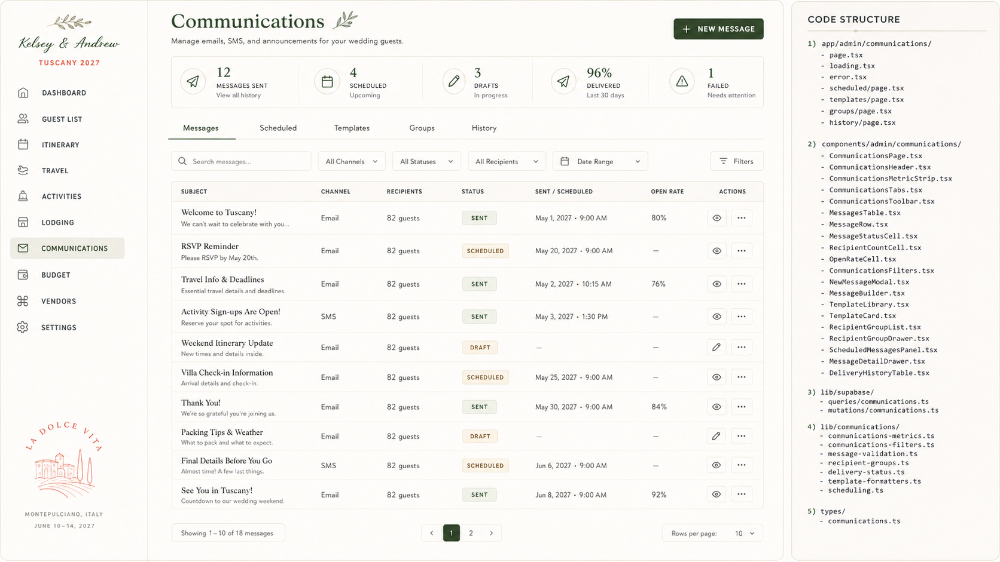

# Admin Spec — Communications

> **Status:** Captured 2026-07-20; **built 2026-07-21** (`app/admin/(dashboard)/communications/`).
> Source: bundled "Claude Code Implementation Brief — Admin Communications Page" (brief 3 of 4) +
> approved mockup.
>
> **What was built:** five tabs (Messages · Scheduled · Templates · Groups · History) with `?tab=`
> in the URL; metric strip; search + channel/status filters + pagination; a composer covering
> channel → recipients → content → schedule → preview, with merge tokens and a validation panel;
> **live recipient resolution** against the guest list, including who gets left out for want of an
> address; saved dynamic recipient groups; ten seeded system templates.
>
> **What was deliberately NOT built — see `docs/decisions.md` D17:** any send path, the
> `communication_recipients` delivery table, per-recipient delivery statuses, and the Open Rate
> column. There is no provider, so none of those can hold a true value. `sent` on a message means
> *a human sent it elsewhere and logged it here*. Also not built: static (hand-picked) groups —
> `RecipientRule.partyIds` exists in the type and resolver but has no UI yet — quiet hours, and
> unsubscribe handling, all of which only bite once sending is real.
> **Maps to:** net-new page `/admin/communications`. No admin communications page exists today.
> (Per-vendor / per-venue "communication" log RPCs exist — `admin_add_vendor_communication`,
> `admin_add_venue_communication` — but those are vendor-relationship notes, a different concept
> from this guest email/SMS broadcast tool.)
> **Repo reconciliation (read before building):** brief assumes Tailwind + TanStack + direct
> Supabase reads and an email/SMS **provider integration**; repo uses **CSS Modules** + **Supabase
> RPCs** under `app/admin/(dashboard)/` and has **no messaging provider wired**. Per the brief's
> "Provider boundaries" section, sending should be a clearly labeled **draft/queue** action until a
> real provider is connected — **do not claim messages were sent** without an active integration.
> Mockup's **"Code Structure" panel** lists the intended file tree — adapt paths/stack.

## Mockup reference



- **Header:** title "Communications"; subtitle "Manage emails, SMS, and announcements for your
  wedding guests."; **+ NEW MESSAGE** button.
- **Metric strip (5):** `12 Messages Sent` (View all history) · `4 Scheduled` (Upcoming) ·
  `3 Drafts` (In progress) · `96% Delivered` (Last 30 days) · `1 Failed` (Needs attention).
- **Tabs:** **Messages** (active) · Scheduled · Templates · Groups · History.
- **Toolbar:** Search messages… · All Channels · All Statuses · All Recipients · Date Range · Filters.
- **Messages table columns:** Subject (+ preview line) · Channel · Recipients · Status ·
  Sent/Scheduled · Open Rate · Actions (preview eye + overflow).
- **Sample rows:** Welcome to Tuscany! (Email, 82 guests, **Sent**, May 1 2027 9:00 AM, 80%) ·
  RSVP Reminder (Email, **Scheduled** May 20) · Travel Info & Deadlines (Email, Sent, 76%) ·
  Activity Sign-ups Are Open! (**SMS**, Sent) · Weekend Itinerary Update (Email, **Draft**) · Villa
  Check-in Information (Scheduled May 25) · Thank You! (Sent, 84%) · Packing Tips & Weather (Draft) ·
  Final Details Before You Go (SMS, Scheduled Jun 6) · See You in Tuscany! (Sent, 92%).
- **Pagination:** "Showing 1–10 of 18 messages" · pages 1–2 · Rows per page 10.

> ⚠️ **Wedding-fact note:** mockup message dates run **May–Jun 2027**; the decorative sidebar
> postmark reads "Montepulciano · June 10–14, 2027". Canonical is **June 16–21, 2027 · Tuscany**.
> Reconcile on build. See `docs/admin/README.md`.

---
## 3. CLAUDE CODE IMPLEMENTATION BRIEF

### Admin Communications Page

Build:

```
/admin/communications
```

The page must manage email, SMS, announcements, recipient groups, scheduling, templates, and delivery history.

Do not claim real sending, open tracking, or SMS functionality unless a provider is connected.

### A. Routes

Create:

```
app/
  admin/
    communications/
      page.tsx
      loading.tsx
      error.tsx

      scheduled/
        page.tsx

      templates/
        page.tsx

      groups/
        page.tsx

      history/
        page.tsx
```

Primary URL state:

```
/admin/communications?tab=messages
/admin/communications?tab=scheduled
/admin/communications?tab=templates
/admin/communications?tab=groups
/admin/communications?tab=history
```

Supported parameters:

tab

search

channel

status

recipientGroup

dateFrom

dateTo

sort

page

pageSize

### B. Components

Create:

```
components/
  admin/
    communications/
      CommunicationsPage.tsx
      CommunicationsHeader.tsx
      CommunicationsMetricStrip.tsx
      CommunicationsTabs.tsx
      CommunicationsToolbar.tsx

      MessagesTable.tsx
      MessageRow.tsx
      MessageSubjectCell.tsx
      MessageStatusCell.tsx
      RecipientCountCell.tsx
      DeliveryMetricCell.tsx
      MessageActionsMenu.tsx

      NewMessageModal.tsx
      MessageBuilder.tsx
      MessageChannelSelector.tsx
      RecipientSelector.tsx
      RecipientPreview.tsx
      EmailEditor.tsx
      SmsEditor.tsx
      AnnouncementEditor.tsx
      MessageScheduleSection.tsx
      MessageValidationPanel.tsx

      MessageDetailDrawer.tsx
      MessageOverviewTab.tsx
      MessageRecipientsTab.tsx
      MessageDeliveryTab.tsx
      MessageHistoryTab.tsx

      TemplatesLibrary.tsx
      TemplateCard.tsx
      TemplateForm.tsx
      DuplicateTemplateDialog.tsx

      RecipientGroupsTable.tsx
      RecipientGroupDrawer.tsx
      RecipientGroupBuilder.tsx
      RecipientRuleBuilder.tsx

      ScheduledMessagesPanel.tsx
      DeliveryHistoryTable.tsx
      FailedDeliveryPanel.tsx

      CommunicationsPagination.tsx
      CommunicationsEmptyState.tsx
```

Create:

```
types/communications.ts
```

Add:

```
lib/
  supabase/
    queries/
      communications.ts
    mutations/
      communications.ts

  communications/
    communications-metrics.ts
    recipient-resolution.ts
    recipient-rules.ts
    message-validation.ts
    channel-capabilities.ts
    delivery-status.ts
    template-formatters.ts
    scheduling.ts
```

### C. Header and metrics

Header:

Communications

Manage emails, SMS, and announcements for your wedding guests.

Primary action:

+ New Message

Metrics:

12 Messages Sent

View all history

4 Scheduled

Upcoming

3 Drafts

In progress

96% Delivered

Last 30 days

1 Failed

Needs attention

Type:

```
export interface CommunicationsMetrics {
  sentCount: number;
  scheduledCount: number;
  draftCount: number;

  deliveredCount: number;
  failedCount: number;
  deliveryRate: number;

  reportingWindowDays: number;
}
```

Only display an open rate when tracking is actually enabled and supported by the email provider.

### D. Tabs

Use:

Messages

Scheduled

Templates

Groups

History

### E. Messages table

Columns:

Subject

Channel

Recipients

Status

Sent / Scheduled

Open Rate

Actions

Recommended widths:

Subject: 320px

Channel: 110px

Recipients: 120px

Status: 115px

Sent / Scheduled: 190px

Open Rate: 100px

Actions: 90px

Subject cell:

Welcome to Tuscany!

We can’t wait to celebrate with you…

Statuses:

Draft

Scheduled

Sending

Sent

Partially Delivered

Failed

Cancelled

Channels:

Email

SMS

Announcement

Email + SMS

### F. Message builder flow

The New Message action opens a full modal or dedicated editor with these steps:

1. Channel

2. Recipients

3. Content

4. Schedule

5. Review

#### Channel

Select:

Email

SMS

Both

Website announcement

Disable channels that are not configured.

#### Recipients

Support:

All invited guests

All attending guests

Adults only

Children’s primary contacts

Awaiting RSVP

Missing travel

Activity attendees

Activity waitlist

Specific event attendees

Specific lodging property

Transportation group

Specific party

Individual guests

Saved recipient group

The recipient count must update before sending.

#### Content

Email fields:

Subject

Preview text

Heading

Body

Button label

Button destination

Footer

SMS fields:

Message body

Character count

Link

#### Schedule

Options:

Send now

Schedule for later

Save draft

Respect quiet hours and communication settings.

#### Review

Show:

Channel

Recipient count

Excluded recipients

Subject

Content preview

Scheduled date/time

Wedding or guest time zone

### G. Recipient groups

Support static and dynamic groups.

Static:

Specific selected guests

Dynamic examples:

Attending adults

Families with children

Awaiting RSVP

Missing travel

Villa Rosa guests

Wine tasting attendees

Guests needing transportation

Rule builder fields:

RSVP status

Age category

Party tag

Event response

Activity booking

Travel submission

Lodging property

Transportation status

Dietary need

Guest side

Custom tag

Recipient resolution must occur again at send time for dynamic groups.

### H. Templates

Create default templates:

Initial invitation

RSVP reminder

Travel information request

Activity sign-ups open

Schedule update

Lodging assignment

Transportation confirmation

Final details

Thank-you

Custom announcement

Template fields:

Name

Channel

Subject

Preview text

Body

CTA label

CTA route

Default recipient rule

Category

Status

Do not overwrite edited templates when system defaults change.

### I. Message details

Drawer tabs:

Overview

Recipients

Delivery

History

Delivery tab should show:

Queued

Sent

Delivered

Opened, when supported

Clicked, when supported

Failed

Bounced

Unsubscribed

Do not expose recipient email addresses unnecessarily in broad views.

### J. Database model

Messages:

```
create table if not exists communication_messages (
  id uuid primary key default gen_random_uuid(),

  name text,
  channel text not null,

  subject text,
  preview_text text,
  body_html text,
  body_text text,

  status text not null default 'draft',

  scheduled_at timestamptz,
  sent_at timestamptz,

  recipient_definition jsonb,
  resolved_recipient_count integer,

  template_id uuid,

  created_by uuid,
  created_at timestamptz not null default now(),
  updated_at timestamptz not null default now()
);
```

Recipients:

```
create table if not exists communication_recipients (
  id uuid primary key default gen_random_uuid(),

  message_id uuid not null
    references communication_messages(id)
    on delete cascade,

  guest_id uuid references guests(id) on delete set null,

  channel_address text,
  delivery_status text not null default 'pending',

  provider_message_id text,

  queued_at timestamptz,
  sent_at timestamptz,
  delivered_at timestamptz,
  opened_at timestamptz,
  clicked_at timestamptz,
  failed_at timestamptz,

  failure_reason text,

  created_at timestamptz not null default now()
);
```

Templates:

```
create table if not exists communication_templates (
  id uuid primary key default gen_random_uuid(),

  name text not null,
  category text,
  channel text not null,

  subject text,
  preview_text text,
  body_html text,
  body_text text,

  default_recipient_definition jsonb,

  is_system boolean not null default false,
  is_active boolean not null default true,

  created_at timestamptz not null default now(),
  updated_at timestamptz not null default now()
);
```

Groups:

```
create table if not exists communication_groups (
  id uuid primary key default gen_random_uuid(),

  name text not null,
  group_type text not null,
  rule_definition jsonb,
  description text,

  created_at timestamptz not null default now(),
  updated_at timestamptz not null default now()
);
```

### K. Provider boundaries

Create provider abstractions:

lib/communications/providers/

```
  email-provider.ts
  sms-provider.ts
  mock-provider.ts
```

Interface:

```
export interface CommunicationProvider {
  sendEmail(input: SendEmailInput): Promise<SendResult>;
  sendSms?(input: SendSmsInput): Promise<SendResult>;
}
```

Do not place provider secrets in client components.

### L. Safety and validation

Before sending:

Confirm recipient count

Exclude guests without required contact channel

Respect unsubscribe settings

Prevent duplicate send

Validate links

Validate scheduled time

Respect quiet hours

Require confirmation for more than a configurable recipient threshold

Sending to all guests should require explicit confirmation.

### M. Acceptance criteria

The Communications page is complete when:

Message, Scheduled, Templates, Groups, and History tabs work

Recipient counts are calculated accurately

Dynamic groups resolve from current guest data

Drafting and scheduling work

Real sends occur only when a provider is configured

Delivery statuses are not fabricated

Failed deliveries are visible

Message history is connected to guest history

Filters persist in URL state

Styling matches the approved Communications mockup

