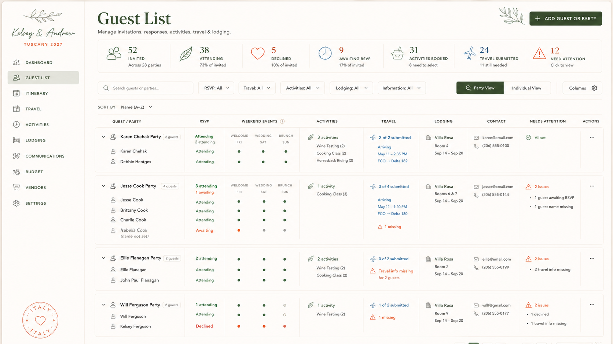
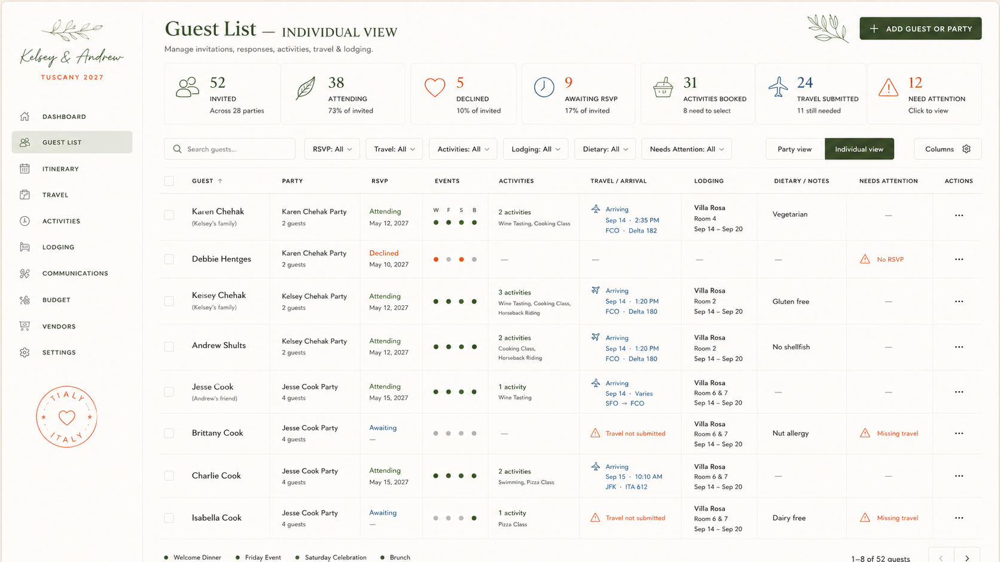
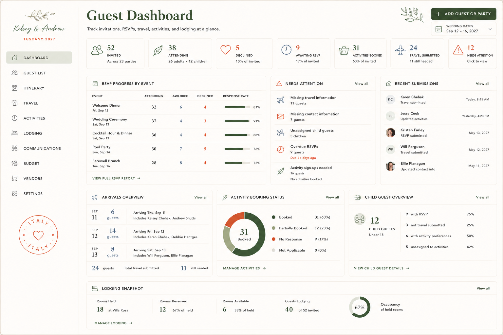

# Admin Spec — Guest List + Dashboard (+ shared admin foundation)

> **Status:** Captured 2026-07-20 — **not yet built.** Source: "Claude Code Implementation
> Brief — Guest List" + two approved mockups (Guest List, Guest Dashboard; transcribed below, PNGs
> not committed).
> **This is the foundational admin brief — build it first.** Its §1–10 define the shared admin
> **shell, design system, typography, borders/radii, sidebar, page header, and summary metric
> strip** that every other admin spec (Travel, Itinerary, Budget, Settings) reuses. §11 specs the
> **Guest Dashboard**; §12–13 spec the **Guest List** Party View and Individual View.
> **Maps to:** existing `app/admin/(dashboard)/` (Dashboard `page.tsx`) and `guests/`
> (`GuestsManager.tsx`, RPCs `admin_list_guests`, `admin_upsert_guest`, `admin_upsert_party`, …).
> This brief is a **much richer redesign** of both.
> **Repo reconciliation (read before building):**
> - Stack: brief assumes Tailwind utility classes + CSS custom props (`var(--ink-700)`), direct
>   Supabase reads, and shared component primitives. Repo uses **CSS Modules** + **Supabase RPCs**
>   (`admin_*`) + the `(dashboard)` route group. Adapt.
> - **Fonts:** the brief suggests **Inter / Manrope** for the UI font. `CLAUDE.md` explicitly
>   **forbids** substituting a geometric sans (Inter, Poppins, Montserrat) for the guest site's
>   "Option A" fonts (Instrument Sans UI / Fraunces / Cormorant / Pinyon). Decide deliberately
>   whether admin may diverge from the guest brand or must share the Option-A stack. **Do not adopt
>   Inter by default.**
> - Design tokens: reuse the existing `--color-*` / `--ink` / `--olive-*` palette in
>   `styles/tokens.css` — do **not** introduce a parallel `--admin-*` token set without sign-off
>   (see `CLAUDE.md` "RULE — adapt, never duplicate").

## Mockup reference — Guest List (transcribed)

**Party View:**



**Individual View** (§13 — one row per guest, with Party, Dietary/Notes columns):



Shared sidebar: "Kelsey & Andrew · TUSCANY 2027"; nav Dashboard, **Guest List** (active), Itinerary,
Travel, Activities, Lodging, Communications, Budget, Vendors, Settings; Italy postmark.

- **Header:** title "Guest List"; subtitle "Manage invitations, responses, activities, travel &
  lodging."; **+ ADD GUEST OR PARTY** button.
- **Metric strip (7):** `52 Invited` (Across 28 parties) · `38 Attending` (26 adults · 12 children)
  · `5 Declined` (10% of invited) · `9 Awaiting RSVP` (17% of invited) · `31 Activities Booked`
  (8 need to select) · `24 Travel Submitted` (11 still needed) · `12 Need Attention` (Click to view).
- **Toolbar:** Search · RSVP: All · Travel: All · Activities: All · Lodging: All · Information: All ·
  **Party View | Individual View** · Columns.
- **Sub-tabs:** All Guests · Needs Attention 12 · Awaiting RSVP 9 · Travel Missing 11 · Activity
  Follow-up 8 · Attending 38 · Declined 5.
- **Table columns:** Guest/Party · Child · Invited · RSVP · Weekend Events (FRI/SAT/SUN dots) ·
  Activities · Travel · Lodging · Contact · Needs Attention · Actions.
- **Sample rows:** **Karen Chehak Party** (2 guests → Karen Chehak Adult, Debbie Hentges Child 7;
  Definitely Invited May 12 2027; all Attending; 2 activities Wine Tasting(2)/Cooking Class(2);
  Arriving Sep 14 2:35 PM FCO Delta 182; Villa Rosa Room 4 Sep 14–20; karen@email.com
  (203) 555-0100; **All set!**). **Jesse Cook Party** (4 guests; 3 attending / 1 awaiting; 1 activity
  Wine Tasting(4); 0 of 4 travel submitted; Villa Rosa Rooms 6 & 7; **3 issues** — 1 guest awaiting
  RSVP, 2 travel info missing). **Will Ferguson Party** (2 guests; 2 activities; 2 of 2 travel
  submitted; **All set!**).
- **Pagination:** "1–3 of 28 parties" · Rows per page 20 · pages 1–2.

## Mockup reference — Guest Dashboard (§11) (transcribed)



- **Header:** title "Guest Dashboard"; subtitle "Track invitations, RSVPs, travel, activities, and
  lodging at a glance."; **+ ADD GUEST OR PARTY** button; **WEDDING DATES Sep 12 – 16, 2027** chip.
- **Metric strip (7):** `52 Invited` (Across 23 parties) · `38 Attending` (26 adults · 12 children)
  · `5 Declined` (10%) · `9 Awaiting RSVP` (17%) · `31 Activities Booked` (60% of invited) ·
  `24 Travel Submitted` (11 still needed) · `12 Needs Attention`.
- **RSVP Progress by Event:** Welcome Dinner (Fri Sep 12) 32 attending / 6 awaiting / 4 declined —
  81% · Wedding Ceremony (Sat Sep 13) 37/4/3 — 91% · Cocktail Hour & Dinner (Sat Sep 13) 36/4/4 —
  88% · Pool Party (Sun Sep 14) 30/7/5 — 76% · Farewell Brunch (Tue Sep 16) 28/8/4 — 73%.
- **Needs Attention:** Missing travel information (11) · Missing contact information (7) ·
  Unassigned child guests (5) · Overdue RSVPs (9, Due 4+ days ago) · Activity sign-ups needed (16).
- **Recent Submissions:** Karen Chehak (Travel submitted, Today 9:41 AM) · Jesse Cook (Updated
  activities, Yesterday 4:23 PM) · Kristen Farley (RSVP submitted, May 13 2027) · Will Ferguson
  (Travel submitted, May 12 2027) · Ellie Flanagan (Updated contact info, May 11 2027).
- **Arrivals Overview:** Sep 11 — 6 guests (incl. Kelsey Chehak, Andrew Shutts) · Sep 12 — 14 guests
  · Sep 13 — 8 guests; 24 total submitted, 11 still needed.
- **Activity Booking Status** (donut): Booked 31 (60%) · Partially Booked 12 (23%) · No Response
  9 (17%) · Not Applicable 0 (0%).
- **Child Guest Overview:** 12 child guests under 18 — 9 with RSVP (75%) · 3 not travel submitted
  (25%) · 6 with activity preferences (50%) · 5 unassigned to activities (42%).
- **Lodging Snapshot:** 18 Rooms Held (Villa Rosa) · 12 Reserved (67% of held) · 6 Available (33%) ·
  40 Guests Lodging (of 52 invited) · 67% Occupancy.

> ⚠️ **Wedding-fact discrepancies (do not copy verbatim):** mockups show "TUSCANY 2027", the
> Dashboard shows **"Sep 12–16, 2027"**, and Guest List "Invited" dates read "May 2027".
> Canonical per `CLAUDE.md` is **Tuscany, Italy · June 16–21, 2027**. The couple is
> **Kelsey & Andrew** (mockup "Andrew Shutts" — confirm surname on build). Reconcile on build; see
> `docs/admin/README.md`.

---
## CLAUDE CODE IMPLEMENTATION BRIEF

Project objective

Build the private wedding-planning admin interface shown in the approved reference mockups.

The interface must recreate the visual structure, spacing, data density, navigation, typography, color hierarchy, table layout, and component behavior as closely as possible.

Create three connected admin screens:

```
/admin/dashboard
/admin/guests?view=party
/admin/guests?view=individual
```

The dashboard and both guest-list views must share the same application shell, navigation, design tokens, filters, summary metrics, and Supabase data.

Do not create three unrelated static pages. Build a reusable production system.

## 1. CORE TECHNICAL REQUIREMENTS

Use:

Next.js App Router

 TypeScript

 Tailwind CSS

 Supabase

 Lucide React icons

 TanStack Table

 date-fns

 React Hook Form

 Zod

Recommended supporting packages:

npm install @tanstack/react-table lucide-react date-fns zod react-hook-form @hookform/resolvers

Do not use a generic dashboard template.

Do not use Material UI, Bootstrap, Chakra UI, Ant Design, or shadcn’s default visual styling without heavily restyling it.

The final interface should feel custom, editorial, warm, and wedding-specific.

## 2. ROUTE STRUCTURE

Use the following route organization:

```
app/
   admin/
   layout.tsx
   dashboard/
     page.tsx
     loading.tsx
   guests/
     page.tsx
     loading.tsx
   itinerary/
     page.tsx
   travel/
     page.tsx
   activities/
     page.tsx
   lodging/
     page.tsx
   communications/
     page.tsx
   budget/
     page.tsx
   vendors/
     page.tsx
   settings/
     page.tsx
```

The left navigation must remain visible across all admin pages.

The guest-list route should use a URL search parameter:

```
/admin/guests?view=party
 /admin/guests?view=individual
```

The selected view must persist in the URL.

## 3. COMPONENT STRUCTURE

Create reusable components using this structure:

```
components/
   admin/
   shell/
     AdminShell.tsx
     AdminSidebar.tsx
     AdminHeader.tsx
     SidebarBrand.tsx
     SidebarNavItem.tsx
     SidebarPostmark.tsx
shared/
     PageTitle.tsx
     SummaryMetricStrip.tsx
     SummaryMetricCard.tsx
     FilterBar.tsx
     SearchField.tsx
     SegmentedControl.tsx
     StatusBadge.tsx
     AttentionBadge.tsx
     SectionCard.tsx
     EmptyState.tsx
     LoadingSkeleton.tsx
     OverflowMenu.tsx
     DateRangeSelector.tsx
dashboard/
     DashboardMetrics.tsx
     RsvpProgressTable.tsx
     NeedsAttentionPanel.tsx
     RecentSubmissionsPanel.tsx
     UpcomingArrivalsPanel.tsx
     ActivityBookingPanel.tsx
     LodgingSnapshotPanel.tsx
guests/
     GuestListHeader.tsx
     GuestMetrics.tsx
     GuestFilters.tsx
     GuestViewToggle.tsx
     GuestColumnPicker.tsx
     PartyTable.tsx
     PartyRow.tsx
     PartyGuestList.tsx
     WeekendEventDots.tsx
     ActivitySummaryCell.tsx
     TravelSummaryCell.tsx
     LodgingSummaryCell.tsx
     ContactSummaryCell.tsx
     NeedsAttentionCell.tsx
     IndividualTable.tsx
     IndividualRow.tsx
     GuestDetailDrawer.tsx
     PartyDetailDrawer.tsx
     AddGuestPartyModal.tsx
```

Also create:

```
lib/
   supabase/
   client.ts
   server.ts
   queries/
     dashboard.ts
     guests.ts
     rsvps.ts
     activities.ts
     travel.ts
     lodging.ts
   guest-status.ts
   attention-rules.ts
   formatters.ts
   constants.ts
types/
   guest.ts
   dashboard.ts
   database.ts
```

## 4. GLOBAL ADMIN SHELL

Desktop layout

The approved mockups use a fixed left sidebar with the content area occupying the remaining width.

Use:

Sidebar width: 228px to 244px

 Main content min-width: approximately 1180px

 Page max-width: none on desktop

 Outer page padding: 24px to 28px

Structure:

```
<div className="min-h-screen bg-admin-canvas">
   <AdminSidebar />
   <main className="ml-[232px] min-h-screen px-7 py-5">
   {children}
   </main>
 </div>
```

The admin pages are optimized for large desktop screens.

For screens below approximately 1200px, allow the central data areas to scroll horizontally rather than crushing all columns.

## 5. VISUAL DESIGN SYSTEM

Color palette

Use CSS variables.

```
:root {
   --admin-canvas: #f8f5ef;
   --admin-surface: #fffdfa;
   --admin-surface-soft: #fbf8f2;
--forest-900: #29422f;
   --forest-800: #35523b;
   --forest-700: #45634a;
   --forest-200: #dce4da;
   --forest-100: #edf1eb;
--terracotta-700: #c95f37;
   --terracotta-600: #df7448;
   --terracotta-100: #fae9df;
--sky-700: #47799d;
   --sky-600: #648eae;
   --sky-100: #e7eff5;
--sage-700: #6f8166;
   --sage-500: #9aaa91;
   --sage-100: #edf1e9;
--gold-700: #b78a2d;
   --gold-500: #d4a43a;
   --gold-100: #f7efd8;
--ink-900: #252722;
   --ink-700: #464941;
   --ink-500: #747870;
   --ink-300: #aeb2aa;
--line: #e6e1d8;
   --line-strong: #d9d2c7;
 }
Map these to Tailwind through tailwind.config.ts or CSS variables.
```

Color usage rules

Forest green: primary headings, selected navigation, positive statuses, buttons

Terracotta: warnings, missing information, declined status

Sky blue: travel and flight information

Sage: activities and soft positive states

Gold: pending states where needed

Warm cream: full-page background

White/off-white: cards and data surfaces

Avoid bright red, neon blue, or cool gray dashboard styling

## 6. TYPOGRAPHY

Use a restrained two-font system.

Editorial heading font

Use a free elegant serif such as:

Cormorant Garamond

Alternative:

DM Serif Display

Use the serif only for:

Main page titles

Large numeric accents where appropriate

Small section flourishes sparingly

Interface font

Use:

Inter

Alternative:

Manrope

Use sans-serif for:

Navigation

Table data

Buttons

Filters

Labels

Forms

Suggested scale

Page title:

```
 font-family: editorial serif;
 font-size: 44px;
 line-height: 1;
 font-weight: 500;
```

Subtitle:

```
 font-size: 13px;
 line-height: 1.5;
 color: var(--ink-700);
```

Section heading:

```
 font-size: 12px;
 font-weight: 600;
 letter-spacing: 0.04em;
 text-transform: uppercase;
```

Table header:

```
 font-size: 10px;
 font-weight: 650;
 letter-spacing: 0.07em;
 text-transform: uppercase;
```

Primary table text:

```
 font-size: 12px;
```

Secondary table text:

```
 font-size: 10.5px;
 color: var(--ink-500);
```

Do not make the interface typography overly large.

The mockups are information-dense but airy.

## 7. BORDERS, RADII, AND SHADOWS

Use very subtle boundaries.

Primary border radius: 8px

 Small controls: 6px

 Cards: 9px

 Large modals: 12px

Borders:

```
border: 1px solid var(--line);
```

Shadows should be nearly imperceptible:

```
box-shadow: 0 2px 10px rgba(55, 50, 42, 0.025);
```

Do not use heavy SaaS shadows.

Do not use floating glass effects.

Do not use large rounded pill cards everywhere.

## 8. LEFT SIDEBAR

The sidebar is persistent on desktop.

Sidebar structure

Top:

Small olive branch line-art graphic

Script-style Kelsey & Andrew

Small uppercase TUSCANY 2027

Navigation:

Dashboard

 Guest List

 Itinerary

 Travel

 Activities

 Lodging

 Communications

 Budget

 Vendors

 Settings

Bottom:

Terracotta Italy postmark illustration

Sidebar styling

Background: #fffdfa

 Right border: 1px solid #e6e1d8

 Navigation width: full minus 20px side margins

 Navigation row height: 42px

 Navigation icon size: 17px

 Navigation label: 11px uppercase, slightly tracked

Active nav item:

```
background: linear-gradient(
   90deg,
   rgba(69, 99, 74, 0.14),
   rgba(69, 99, 74, 0.08)
 );
 color: var(--forest-900);
 border-radius: 6px;
```

Use thin Lucide icons.

Do not use filled icons.

## 9. SHARED PAGE HEADER

All three pages include:

Large editorial title

One-line description

Decorative olive branch near the top right

Dark forest-green Add Guest or Party button

Button:

Height: 38px

 Padding: 0 18px

 Background: forest green

 Text: white

 Icon: plus

 Font size: 11px

 Uppercase or small-caps appearance

 Letter spacing: 0.04em

 Border radius: 5px

Use:

```
<PageTitle
   title="Guest List"
   subtitle="Manage invitations, responses, activities, travel & lodging."
   action={<AddGuestButton />}
 />
```

Dashboard title:

Guest Dashboard

Individual view title:

Guest List — Individual View

Party view title:

Guest List

## 10. SUMMARY METRIC STRIP

Use the same seven summary values across all three guest-related screens:

52 Invited

 38 Attending

 5 Declined

 9 Awaiting RSVP

 31 Activities Booked

 24 Travel Submitted

 12 Need Attention

These values must come from Supabase, not hardcoded values.

Layout

Desktop:

Seven equal columns in one horizontal strip

 Height: approximately 112px on dashboard

 Height: approximately 98px on guest list views

Each metric includes:

Thin line icon

Large serif or semi-serif number

Uppercase label

Small supporting text

Suggested icons:

Invited: Users

 Attending: Leaf or UserCheck

 Declined: Heart

 Awaiting: Clock3

 Activities: ShoppingBasket or CalendarCheck

 Travel: Plane

 Needs attention: TriangleAlert

Icon color varies by category.

Separate metrics with faint vertical rules.

Do not make every metric an individually floating card in guest-list pages. They should read as one connected summary strip.

Example:

```
<SummaryMetricStrip>
   <SummaryMetricCard
   icon={Users}
   value={52}
   label="Invited"
   detail="Across 28 parties"
   tone="forest"
   />
 </SummaryMetricStrip>
```

Each metric should be clickable and apply the corresponding page filter.

## 11. GUEST DASHBOARD PAGE

Route:

```
/admin/dashboard
```

Overall layout

After the page header and metric strip, use:

Row 1:

 RSVP Progress by Event: 50%

 Needs Attention: 25%

 Recent Submissions: 25%

Row 2:

 Upcoming Arrivals: 30%

 Activity Booking Status: 35%

 Lodging Snapshot: 35%

Use CSS Grid:

```
grid-template-columns: 2fr 1.05fr 1.25fr;
 gap: 16px;
```

Second row:

```
grid-template-columns: 1.05fr 1fr 1.15fr;
```

All cards should align vertically within their row.

11A. RSVP Progress by Event

Create a table card with:

Event

 Attending

 Awaiting

 Declined

 Response Rate

Example events:

Welcome Dinner

 Wedding Ceremony

 Cocktail Hour & Dinner

 Pool Party

 Farewell Brunch

Each row includes:

Event name

Event date beneath

Count and percentage

Small horizontal progress bar

Progress bars:

Track: warm light gray

 Fill: forest green

 Height: 5px

 Radius: full

Footer action:

VIEW FULL RSVP REPORT →

11B. Needs Attention panel

Display grouped issue types:

Missing travel information

 11 guests

Missing contact information

 7 guests

Unnamed guests

 5 guests

Overdue RSVPs

 9 guests

 Due 7+ days ago

Activity sign-up needed

 14 guests

 No activities booked

Each row includes:

Thin colored icon

Issue name

Count

Optional supporting detail

Click action that navigates to a filtered guest list

Example:

```
/admin/guests?view=individual&attention=missing-travel
```

11C. Recent Submissions panel

Display the five most recent guest updates.

Each row includes:

Avatar or initials circle

Guest name

Action summary

Relative or exact timestamp

Examples:

Karen Chehak

 Travel submitted

 Today, 9:41 AM

Jesse Cook

 Updated activities

 Yesterday, 4:23 PM

Kristen Farley

 RSVP submitted

 May 13, 2027

Pull these from an activity log or submission history table.

11D. Upcoming Arrivals panel

Group arrivals by date.

Example:

SEP 11

 6 guests

 Arriving Thu, Sep 11

 Includes Kelsey Chehak, Andrew Shults

SEP 12

 14 guests

 Arriving Fri, Sep 12

 Includes Karen Chehak, Debbie Hentges

SEP 13

 8 guests

 Arriving Sat, Sep 13

 Includes Will Ferguson, Ellie Flanagan

Footer:

24 guests total travel submitted

 11 still needed

11E. Activity Booking Status

Use one donut chart.

Do not use an external chart library unless already installed. SVG is acceptable.

Segments:

Booked

 Partially Booked

 No Response

 Not Applicable

Center:

31

 Booked

Beside chart:

Booked          31 (60%)

 Partially Booked  12 (23%)

 No Response      9 (17%)

 Not Applicable   0 (0%)

11F. Lodging Snapshot

Show:

Rooms Held     18

 Rooms Reserved   12

 Rooms Available   6

 Guests Lodging   40 of 52 invited

Right side:

Circular occupancy visualization

67%

Occupancy of held rooms

Use forest green for the filled portion.

## 12. GUEST LIST — PARTY VIEW

Route:

```
/admin/guests?view=party
```

This is the default guest view.

Page order

Page header

 Summary metric strip

 Filter toolbar

 Optional sort toolbar

 Party table

 Pagination

12A. Filter toolbar

First row:

Search guests or parties…

 RSVP: All

 Travel: All

 Activities: All

 Lodging: All

 Information: All

 Party View | Individual View

 Columns

Use a single horizontal row.

Search width:

260px to 300px

Filter dropdown widths:

110px to 140px

View toggle aligned toward the right.

Columns button at far right.

Controls:

Height: 36px

 Background: white

 Border: 1px solid line

 Radius: 6px

 Font size: 11px

Selected party view:

Dark forest background

 White text

12B. Sort toolbar

Below filters:

SORT BY

 Name (A–Z)

Keep this row minimal.

Saved filters may be added later, but the first implementation should match the approved mockup.

12C. Party table columns

Use these columns:

Guest / Party

 RSVP

 Weekend Events

 Activities

 Travel

 Lodging

 Contact

 Needs Attention

 Actions

Recommended width distribution:

Guest / Party: 250px

 RSVP: 110px

 Weekend Events: 190px

 Activities: 170px

 Travel: 170px

 Lodging: 150px

 Contact: 155px

 Needs Attention: 170px

 Actions: 56px

Set table minimum width around:

1450px

The page should horizontally scroll on narrower displays.

12D. Party row visual structure

Each party is displayed as a bordered row-card inside the table.

Do not use standard tiny spreadsheet rows.

Each party row should be approximately:

Karen party with 2 guests: 138px tall

 Jesse party with 4 guests: 172px tall

Use:

```
background: var(--admin-surface);
 border: 1px solid var(--line);
 border-radius: 8px;
```

Separate party rows with approximately 12px.

The columns remain aligned across rows.

Guest / Party cell

Display:

Chevron

 Party icon

 Karen Chehak Party

 2 guests

Under this, show each individual guest on a separate line with a person icon:

Karen Chehak

 Debbie Hentges

For unnamed guests:

Isabella Cook

 (name not set)

Use italic gray text for missing names.

RSVP cell

Top party summary:

2 attending

Or:

3 attending

 1 awaiting

Then guest-level statuses aligned with each guest name:

Attending

 Attending

 Awaiting

Color:

Attending: forest

 Awaiting: terracotta or gold

 Declined: terracotta

Weekend Events cell

Use a compact column set:

WELCOME

 FRI

WEDDING

 SAT

BRUNCH

 SUN

Under each header, show one dot for each guest.

Dot colors:

Forest: attending

 Terracotta: declined

 Light gray: awaiting or no response

 Outlined gray: not invited or not applicable

The event dot rows must align with the corresponding guest name.

Create a component:

```
<WeekendEventDots
   guestResponses={guest.eventResponses}
   events={visibleWeekendEvents}
 />
```

Activities cell

Display a leaf icon and summary:

3 activities

Then activity labels:

Wine Tasting (2)

 Cooking Class (2)

 Horseback Riding (2)

Use sage or forest icons.

Travel cell

Display:

2 of 2 submitted

Then:

Arriving

 May 11 · 2:35 PM

 FCO → Delta 182

Use sky blue text and airplane icon.

When missing:

0 of 2 submitted

 Travel info missing

 for 2 guests

Use terracotta warning icon.

Lodging cell

Display:

Villa Rosa

 Room 4

 Sep 14 – Sep 20

Use a small villa or building icon.

Contact cell

Display:

karen@email.com

 (206) 555-0100

Use envelope and phone icons.

Do not show mailing address by default in this compact row.

For missing details:

Email missing

 Phone missing

Needs Attention cell

Complete state:

All set

with green check.

Issue state:

2 issues

 • 1 guest awaiting RSVP

 • 1 guest name missing

Use a terracotta warning icon.

Actions cell

Use a horizontal three-dot menu.

Actions:

View party

 Edit party

 Send message

 Request missing info

 Add guest

 Archive party

 Delete party

Deletion requires confirmation.

## 13. GUEST LIST — INDIVIDUAL VIEW

Route:

```
/admin/guests?view=individual
```

Use one row per guest.

Filter toolbar

Use:

Search guests…

 RSVP: All

 Travel: All

 Activities: All

 Lodging: All

 Dietary: All

 Needs Attention: All

 Party View | Individual View

 Columns

Table columns

Guest

 Party

 RSVP

 Events

 Activities

 Travel / Arrival

 Lodging

 Dietary / Notes

 Needs Attention

 Actions

Recommended widths:

Guest: 170px

 Party: 160px

 RSVP: 120px

 Events: 125px

 Activities: 185px

 Travel / Arrival: 190px

 Lodging: 165px

 Dietary / Notes: 145px

 Needs Attention: 150px

 Actions: 50px

Minimum table width:

1450px

Row height:

82px to 90px

Use horizontal rules rather than card borders around every row.

The individual view should feel slightly more like a refined table than the party view.

Guest cell

Example:

Karen Chehak

 (Kelsey’s family)

Primary name uses 13px medium weight.

Relationship uses 10px muted text.

Party cell

Example:

Karen Chehak Party

 2 guests

Clicking opens the party drawer.

RSVP cell

Example:

Attending

 May 12, 2027

Or:

Awaiting

 —

Events cell

Use abbreviated event headings:

W F S B

Then four corresponding response dots.

Add a footer legend below the table:

● Welcome Dinner

 ● Friday Event

 ● Saturday Celebration

 ● Brunch

The legend is part of the table footer area.

Activities cell

Example:

2 activities

 Wine Tasting, Cooking Class

Truncate after approximately two lines.

Use a tooltip for the full list.

Travel / Arrival cell

Example:

Arriving

 Sep 14 · 2:35 PM

 FCO · Delta 182

Use sky blue.

Missing state:

Travel not submitted

Use terracotta.

Lodging cell

Example:

Villa Rosa

 Room 4

 Sep 14 – Sep 20

Dietary / Notes cell

Examples:

Vegetarian

 Gluten free

 No shellfish

 Nut allergy

 Dairy free

 —

Do not expose private medical information beyond guest-submitted logistical requirements.

Needs Attention cell

Examples:

—

 No RSVP

 Missing travel

 2 issues

Use a warning icon only when an issue exists.

## 14. DATA MODEL

Use the existing Supabase project.

Do not store all guest information in a single wide table.

Use relational tables.

Invitation parties

```
create table invitation_parties (
   id uuid primary key default gen_random_uuid(),
   display_name text not null,
   invited_status text not null default 'definitely',
   relationship_group text,
   side text,
   notes text,
   invitation_sent_at timestamptz,
   created_at timestamptz not null default now(),
   updated_at timestamptz not null default now()
 );
```

Suggested invited_status values:

definitely

 maybe

 not_invited

 invitation_scheduled

 invited

Guests

```
create table guests (
   id uuid primary key default gen_random_uuid(),
   party_id uuid not null references invitation_parties(id) on delete cascade,
   first_name text,
   last_name text,
   display_name text,
   is_primary_contact boolean not null default false,
   is_named_guest boolean not null default true,
   guest_type text default 'adult',
   relationship_label text,
   email text,
   phone text,
   address_line_1 text,
   address_line_2 text,
   city text,
   state_region text,
   postal_code text,
   country text,
   dietary_notes text,
   accessibility_notes text,
   admin_notes text,
   created_at timestamptz not null default now(),
   updated_at timestamptz not null default now()
 );
```

Wedding events

```
create table wedding_events (
   id uuid primary key default gen_random_uuid(),
   title text not null,
   short_label text,
   event_date date,
   starts_at timestamptz,
   ends_at timestamptz,
   location text,
   sort_order integer not null default 0,
   is_rsvp_enabled boolean not null default true,
   created_at timestamptz not null default now()
 );
```

RSVP submissions

```
create table rsvp_submissions (
   id uuid primary key default gen_random_uuid(),
   guest_id uuid not null references guests(id) on delete cascade,
   overall_status text not null,
   submitted_by text,
   submitted_at timestamptz not null default now(),
   updated_at timestamptz not null default now(),
   source text not null default 'guest'
 );
```

Suggested statuses:

awaiting

 started

 attending

 declined

 partially_attending

Event responses

```
create table guest_event_responses (
   id uuid primary key default gen_random_uuid(),
   guest_id uuid not null references guests(id) on delete cascade,
   event_id uuid not null references wedding_events(id) on delete cascade,
   response_status text not null,
   responded_at timestamptz,
   unique (guest_id, event_id)
 );
```

Suggested statuses:

attending

 declined

 awaiting

 not_invited

 not_applicable

Activities

```
create table activities (
   id uuid primary key default gen_random_uuid(),
   title text not null,
   starts_at timestamptz,
   ends_at timestamptz,
   capacity integer,
   booking_status text not null default 'draft',
   sort_order integer default 0,
   created_at timestamptz not null default now()
 );
```

Activity bookings

```
create table activity_bookings (
   id uuid primary key default gen_random_uuid(),
   activity_id uuid not null references activities(id) on delete cascade,
   guest_id uuid not null references guests(id) on delete cascade,
   status text not null default 'booked',
   booked_at timestamptz not null default now(),
   source text not null default 'guest',
   unique (activity_id, guest_id)
 );
```

Suggested statuses:

booked

 waitlisted

 cancelled

 incomplete

Travel submissions

```
create table travel_submissions (
   id uuid primary key default gen_random_uuid(),
   guest_id uuid not null references guests(id) on delete cascade,
   arrival_date date,
   arrival_time time,
   arrival_location text,
   arrival_airline text,
   arrival_flight_number text,
   departure_date date,
   departure_time time,
   departure_location text,
   departure_airline text,
   departure_flight_number text,
   transportation_method text,
   transportation_needed boolean,
   rental_car boolean,
   notes text,
   submitted_at timestamptz not null default now(),
   updated_at timestamptz not null default now(),
   source text not null default 'guest'
 );
```

Lodging

```
create table lodging_properties (
   id uuid primary key default gen_random_uuid(),
   name text not null,
   rooms_held integer,
   address text,
   created_at timestamptz not null default now()
 );

create table lodging_assignments (
   id uuid primary key default gen_random_uuid(),
   guest_id uuid not null references guests(id) on delete cascade,
   property_id uuid references lodging_properties(id),
   room_name text,
   check_in_date date,
   check_out_date date,
   lodging_type text,
   status text,
   guest_submitted_property text,
   created_at timestamptz not null default now(),
   updated_at timestamptz not null default now()
 );
```

Submission activity log

```
create table guest_activity_log (
   id uuid primary key default gen_random_uuid(),
   guest_id uuid references guests(id) on delete cascade,
   party_id uuid references invitation_parties(id) on delete cascade,
   event_type text not null,
   summary text not null,
   actor_type text not null,
   created_at timestamptz not null default now()
 );
```

Examples:

rsvp_submitted

 travel_submitted

 activities_updated

 contact_updated

 lodging_updated

 admin_edit

## 15. TYPESCRIPT TYPES

Create domain types rather than relying directly on raw database row shapes.

```
export type RsvpStatus =
   | 'awaiting'
   | 'started'
   | 'attending'
   | 'declined'
   | 'partially_attending';
export type EventResponseStatus =
   | 'attending'
   | 'declined'
   | 'awaiting'
   | 'not_invited'
   | 'not_applicable';
export interface GuestListGuest {
   id: string;
   partyId: string;
   displayName: string;
   relationshipLabel?: string | null;
   isNamedGuest: boolean;
   isPrimaryContact: boolean;
   email?: string | null;
   phone?: string | null;
   rsvpStatus: RsvpStatus;
   rsvpSubmittedAt?: string | null;
   eventResponses: GuestEventResponse[];
   activityBookings: GuestActivityBooking[];
   travel?: GuestTravelSummary | null;
   lodging?: GuestLodgingSummary | null;
   dietaryNotes?: string | null;
   accessibilityNotes?: string | null;
   attentionItems: AttentionItem[];
 }

export interface GuestListParty {
   id: string;
   displayName: string;
   invitedStatus: string;
   relationshipGroup?: string | null;
   guests: GuestListGuest[];
   summary: PartySummary;
   attentionItems: AttentionItem[];
 }

export interface AttentionItem {
   id: string;
   type:
   | 'missing_rsvp'
   | 'missing_travel'
   | 'missing_email'
   | 'missing_phone'
   | 'unnamed_guest'
   | 'activity_needed'
   | 'travel_conflict'
   | 'lodging_conflict'
   | 'accessibility_review';
   severity: 'neutral' | 'warning' | 'critical';
   label: string;
   guestId?: string;
 }
```

## 16. SUPABASE QUERY STRATEGY

Do not perform one network request per guest.

Fetch related records in a small number of server-side queries.

For the guest list, retrieve:

Parties

 Guests

 Latest RSVP submission

 Event responses

 Activity bookings and activity titles

 Latest travel submission

 Lodging assignments

Build the final view model on the server.

Suggested server function:

```
export async function getGuestListData(): Promise<{
   parties: GuestListParty[];
   guests: GuestListGuest[];
   metrics: GuestMetrics;
   events: WeddingEventSummary[];
 }> {
   // Fetch and normalize related records.
 }
```

Use Promise.all where appropriate.

Calculate dashboard metrics from actual records.

Do not hardcode the approved mockup numbers into the components.

## 17. AUTOMATIC NEEDS-ATTENTION LOGIC

Create a centralized rules engine in:

```
lib/attention-rules.ts
```

Example:

```
export function getGuestAttentionItems(
   guest: GuestListGuest,
   context: AttentionRuleContext
 ): AttentionItem[] {
   const items: AttentionItem[] = [];
if (!guest.isNamedGuest || !guest.displayName.trim()) {
   items.push({
     id: `unnamed-${guest.id}`,
     type: 'unnamed_guest',
     severity: 'warning',
     label: 'Guest name missing',
     guestId: guest.id,
   });
   }
if (guest.rsvpStatus === 'awaiting') {
   items.push({
     id: `rsvp-${guest.id}`,
     type: 'missing_rsvp',
     severity: 'warning',
     label: 'Awaiting RSVP',
     guestId: guest.id,
   });
   }
if (
   guest.rsvpStatus === 'attending' &&
   !guest.travel &&
   context.travelCollectionOpen
   ) {
   items.push({
     id: `travel-${guest.id}`,
     type: 'missing_travel',
     severity: 'warning',
     label: 'Travel information missing',
     guestId: guest.id,
   });
   }
if (guest.isPrimaryContact && !guest.email) {
   items.push({
     id: `email-${guest.id}`,
     type: 'missing_email',
     severity: 'neutral',
     label: 'Email missing',
     guestId: guest.id,
   });
   }
return items;
 }
```

Party attention items should aggregate individual guest issues.

Avoid duplicate warning labels.

## 18. DETAIL DRAWERS

Clicking a guest or party should open a right-side drawer.

Do not navigate away from the table for basic editing.

Party drawer sections

Party overview

 Guests

 Invitation status

 Contact information

 RSVP summary

 Weekend events

 Activities

 Travel

 Lodging

 Notes

 Change history

Guest drawer sections

Guest details

 RSVP

 Event attendance

 Activity bookings

 Travel itinerary

 Lodging assignment

 Dietary and accessibility notes

 Communication history

 Admin notes

Drawer width:

520px to 620px

Use a warm white background and a fixed footer for Save/Cancel actions.

## 19. RESPONSIVE BEHAVIOR

This admin experience is desktop-first.

Desktop: 1440px and wider

Match the approved mockup closely.

Medium: 1024px to 1439px

Sidebar may reduce to approximately 200px

Table scrolls horizontally

Metric strip may wrap into 4 + 3

Dashboard cards may reflow into two columns

Small screens

Do not attempt to squeeze the full desktop table onto mobile.

For screens below 768px:

Collapse sidebar into a drawer

Stack summary metrics

Replace table with compact guest or party cards

Show only core fields

Maintain access to full detail through drawer or modal

Desktop fidelity is the primary requirement.

## 20. INTERACTION REQUIREMENTS

Implement:

Search by guest name, party name, email, or phone

Filter by RSVP status

Filter by travel submitted or missing

Filter by activity selection status

Filter by lodging status

Filter by missing information

Filter by dietary notes in individual view

Sort by name, RSVP state, arrival date, and needs-attention count

Column visibility picker

Party/individual view toggle

Clicking a metric applies a filter

Clicking a dashboard issue navigates to the matching filtered guest list

Clicking a party opens the party drawer

Clicking an individual opens the guest drawer

Overflow action menus

Pagination

Loading skeletons

Empty states

Error states

Keyboard focus states

Accessible labels and semantic table markup where practical

## 21. URL FILTER STATE

Persist filters in URL search parameters.

Example:

```
/admin/guests?view=individual&rsvp=awaiting&travel=missing
```

Suggested parameters:

view

 search

 rsvp

 travel

 activities

 lodging

 information

 dietary

 attention

 sort

 page

This allows dashboard cards and issue links to open precise filtered views.

## 22. REQUIRED VISUAL DETAILS

Recreate these visual characteristics from the approved mockups:

Warm off-white background rather than pure white

Cream-white data cards

Fine gray-beige borders

Dark green serif page titles

Thin line-art olive sprigs

Terracotta postmark at bottom left

Compact, refined navigation

Small line icons

No bulky cards

No strong shadows

Generous horizontal layout

Dense but readable tables

Colored status dots

Blue travel details

Green positive states

Terracotta warnings

Muted uppercase table headers

Strong alignment between guest names and their status rows

White space around major page sections

No excessive botanical decoration inside the operational content

The admin area should reference the guest-facing wedding brand without becoming overly illustrative.

## 23. DO NOT DO THE FOLLOWING

Do not:

Recreate Zola’s exact UI

Use Zola branding

Use a generic admin dashboard template

Use bright red error states

Put every value in a rounded pill

Use large shadows

Use gradients inside charts, cards, or buttons

Hide guest-level data behind party expansion by default

Show only party totals without showing individual names

Require opening each party to see RSVP, travel, or activity status

Combine travel, RSVP, and activity information into one unstructured notes field

Hardcode dashboard metrics

Fetch related data separately for every row

Make the dashboard read like a financial analytics product

overuse leaves, vines, or decorative artwork

## 24. INITIAL SAMPLE DATA

Seed the interface with parties similar to the approved mockups:

Karen Chehak Party

 - Karen Chehak

 - Debbie Hentges

Kelsey Chehak Party

 - Kelsey Chehak

 - Andrew Shults

Jesse Cook Party

 - Jesse Cook

 - Brittany Cook

 - Charlie Cook

 - Isabella Cook

Ellie Flanagan Party

 - Ellie Flanagan

 - John Paul Flanagan

Will Ferguson Party

 - Will Ferguson

 - Kelsey Ferguson

Use mixed states:

Fully complete party

Party with one guest awaiting RSVP

Party with missing travel

Party with unnamed guest

Party with declined guest

Party with activities selected

Party with dietary information

Party with mixed event attendance

The sample data must demonstrate all visual states.

## 25. BUILD ORDER

Implement in this order:

1. Design tokens and fonts

 2. Shared admin shell

 3. Sidebar

 4. Page title and action header

 5. Summary metric strip

 6. Guest data types

 7. Supabase query layer

 8. Party view

 9. Individual view

 10. URL-based filters

 11. Detail drawers

 12. Dashboard

 13. Add/Edit forms

 14. Responsive states

 15. Accessibility and visual polish

Do not begin with separate hardcoded pages.

Build the system from shared reusable components.

## 26. ACCEPTANCE CRITERIA

The implementation is approved when:

The three pages clearly match the approved references

The shared sidebar and header remain visually consistent

Party view shows every guest without requiring expansion

Individual RSVP states align with individual names

Event attendance is visible through status dots

Activities, travel, lodging, contact status, and issues are visible directly in the rows

Individual view contains one guest per row

Dashboard summarizes the same underlying data

Dashboard panels link to filtered guest-list states

Metrics are computed from Supabase data

Filters persist in the URL

Tables remain usable on narrower desktop screens

Colors and typography reflect the wedding brand

The admin interface remains operational and clean rather than overly decorative

## 27. REFERENCE IMAGE PRIORITY

Use the approved reference mockups as the visual source of truth.

Priority order:

1. Overall layout and spacing

 2. Column structure

 3. Typography hierarchy

 4. Color usage

 5. Information density

 6. Status treatment

 7. Decorative details

Where generated reference text is unclear or misspelled, use the written specifications in this handoff rather than reproducing the error.

Do not treat incidental AI-generated text artifacts as intended UI copy.

## 28. FINAL DELIVERABLES

Return:

1. A summary of files created and modified

 2. The final route structure

 3. Any SQL migrations created

 4. Any required environment variables

 5. Any assumptions made

 6. Any functionality that remains mocked

 7. Clear instructions for running and testing the implementation

Environment variables should follow:

```
NEXT_PUBLIC_SUPABASE_URL=
 NEXT_PUBLIC_SUPABASE_ANON_KEY=
 SUPABASE_SERVICE_ROLE_KEY=
```

Do not expose the service-role key to client components.
