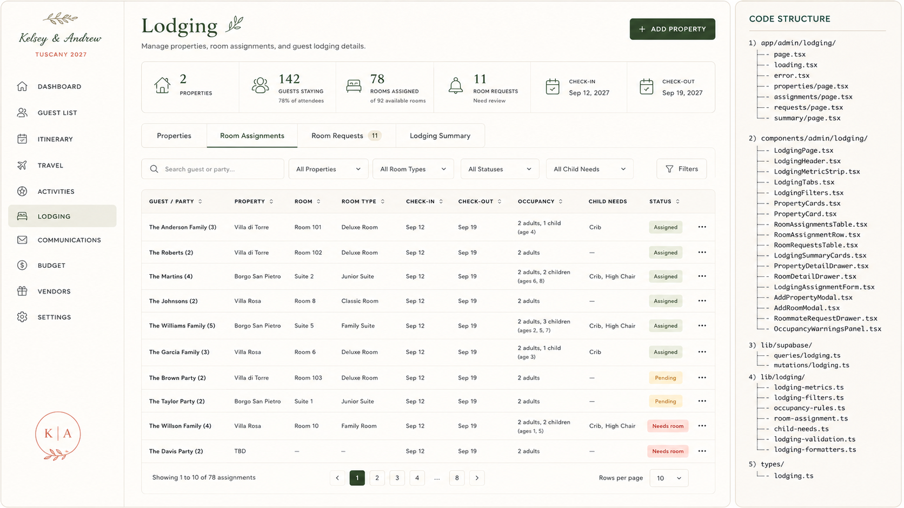

# Admin Spec — Lodging

> **Status:** Captured 2026-07-20 — **not yet built.** Source: bundled "Claude Code Implementation
> Brief — Admin Lodging Page" (brief 2 of 4) + approved mockup.
> **Maps to:** net-new page `/admin/lodging`. No admin lodging page exists today. Note the admin
> already has **Venues** (`app/admin/(dashboard)/venues/`, venue comparison) — that is
> venue-selection, distinct from this guest **room-assignment / occupancy** view. Decide on build
> whether Lodging reuses venue records for "properties".
> **Repo reconciliation (read before building):** brief assumes Tailwind + TanStack + direct
> Supabase reads; repo uses **CSS Modules** + **Supabase RPCs** under `app/admin/(dashboard)/`. The
> mockup's **"Code Structure" panel** lists the intended file tree
> (`components/admin/lodging/*`, `lib/supabase/queries|mutations/lodging`, `lib/lodging/*`,
> `types/lodging.ts`) — adapt. Child-needs (crib/high-chair, ages) ties into the Settings
> adult/child-age config and the Guest List child data — keep consistent.

## Mockup reference



- **Header:** title "Lodging"; subtitle "Manage properties, room assignments, and guest lodging
  details."; **+ ADD PROPERTY** button.
- **Metric strip (6):** `2 Properties` · `142 Guests Staying` (78% of attendees) · `78 Rooms
  Assigned` (of 92 available rooms) · `11 Room Requests` (Need review) · `Check-in Sep 12, 2027` ·
  `Check-out Sep 19, 2027`.
- **Tabs:** Properties · **Room Assignments** (active) · Room Requests 11 · Lodging Summary.
- **Toolbar:** Search guest or party… · All Properties · All Room Types · All Statuses · All Child
  Needs · Filters.
- **Room Assignments table columns:** Guest/Party · Property · Room · Room Type · Check-in ·
  Check-out · Occupancy · Child Needs · Status · Actions.
- **Sample rows:** The Anderson Family (3) · Villa di Torre · Room 101 · Deluxe · Sep 12–19 · 2
  adults, 1 child (age 4) · Crib · **Assigned**. The Roberts (2) · Villa di Torre · Room 102 ·
  Assigned. The Martins (4) · Borgo San Pietro · Suite 2 · Junior Suite · 2 adults, 2 children
  (6, 8) · Crib, High Chair · Assigned. … The Brown Party (2) · **Pending**. The Willson Family (4)
  · Villa Rosa · Room 10 · Family Room · **Needs room**. The Davis Party (2) · **TBD** · Needs room.
- **Properties seen:** Villa di Torre, Borgo San Pietro, Villa Rosa.
- **Pagination:** "Showing 1 to 10 of 78 assignments" · pages 1–8 · Rows per page 10.

> ⚠️ **Wedding-fact note:** mockup uses **Sep 12–19, 2027**; canonical is **June 16–21, 2027 ·
> Tuscany**. Reconcile on build. See `docs/admin/README.md`.

---
## 2. CLAUDE CODE IMPLEMENTATION BRIEF

### Admin Lodging Page

Build the Lodging section at:

```
/admin/lodging
```

The page must recreate the approved Lodging mockup and manage properties, room inventory, room assignments, requests, occupancy, and children’s sleeping needs.

### A. Routes

Create:

```
app/
  admin/
    lodging/
      page.tsx
      loading.tsx
      error.tsx

      properties/
        page.tsx

      assignments/
        page.tsx

      requests/
        page.tsx

      summary/
        page.tsx
```

Use query parameters for active tab and filters:

```
/admin/lodging?tab=properties
/admin/lodging?tab=assignments
/admin/lodging?tab=requests
/admin/lodging?tab=summary
```

Supported URL state:

tab

search

property

roomType

status

childNeeds

occupancy

checkIn

checkOut

sort

page

pageSize

### B. Components

Create:

```
components/
  admin/
    lodging/
      LodgingPage.tsx
      LodgingHeader.tsx
      LodgingMetricStrip.tsx
      LodgingTabs.tsx
      LodgingToolbar.tsx

      PropertyCards.tsx
      PropertyCard.tsx
      PropertyDetailDrawer.tsx
      PropertyForm.tsx
      AddPropertyModal.tsx

      RoomsInventoryTable.tsx
      RoomInventoryRow.tsx
      RoomDetailDrawer.tsx
      RoomForm.tsx
      AddRoomModal.tsx

      RoomAssignmentsTable.tsx
      RoomAssignmentRow.tsx
      AssignmentOccupancyCell.tsx
      AssignmentChildNeedsCell.tsx
      AssignmentStatusCell.tsx
      LodgingAssignmentForm.tsx

      RoomRequestsTable.tsx
      RoomRequestRow.tsx
      RoommateRequestDrawer.tsx
      ResolveRoomRequestDialog.tsx

      LodgingSummaryCards.tsx
      OccupancyByPropertyCard.tsx
      UnassignedGuestsCard.tsx
      ChildNeedsSummaryCard.tsx
      ArrivalDepartureSummaryCard.tsx

      OccupancyWarningsPanel.tsx
      LodgingActionsMenu.tsx
      LodgingPagination.tsx
      LodgingEmptyState.tsx
```

Create:

```
types/lodging.ts
```

Add:

```
lib/
  supabase/
    queries/
      lodging.ts
    mutations/
      lodging.ts

  lodging/
    lodging-metrics.ts
    occupancy-rules.ts
    room-assignment.ts
    child-needs.ts
    lodging-conflicts.ts
    lodging-filters.ts
    lodging-validation.ts
    lodging-formatters.ts
```

### C. Header and metrics

Header:

Lodging

Manage properties, room assignments, and guest lodging details.

Primary action:

+ Add Property

Metrics:

2 Properties

1,240 nights held

142 Guests Staying

78% of invited

78 Rooms Assigned

Of 92 available rooms

11 Room Requests

Need review

Check-In

Sep 12, 2027

Check-Out

Sep 19, 2027

Type:

```
export interface LodgingMetrics {
  propertyCount: number;
  roomCount: number;
  roomNightsHeld: number;

  guestsStayingCount: number;
  guestStayingPercentage: number;

  assignedRoomCount: number;
  availableRoomCount: number;
  unassignedGuestCount: number;

  openRequestCount: number;

  defaultCheckInDate?: string | null;
  defaultCheckOutDate?: string | null;
}
```

### D. Tabs

Use:

Properties

Room Assignments

Room Requests

Lodging Summary

The approved default should be Room Assignments.

### E. Room assignments table

Columns:

Guest / Party

Property

Room

Room Type

Check-In

Check-Out

Occupancy

Child Needs

Status

Actions

Recommended widths:

Guest / Party: 210px

Property: 145px

Room: 100px

Room Type: 140px

Check-In: 100px

Check-Out: 100px

Occupancy: 170px

Child Needs: 160px

Status: 110px

Actions: 52px

Example row:

The Anderson Family (3)

Villa di Torre

Room 101

Deluxe Room

Sep 12

Sep 19

2 adults, 1 child (age 4)

Crib

Assigned

Occupancy must show adult and child counts, not only total people.

### F. Child lodging needs

Support:

Crib

Pack-and-play

Rollaway bed

High chair

Bed rail

Connecting room

Ground-floor room

Quiet room

Accessible room

Other

Guest-level needs should be collected through RSVP or lodging forms and summarized at party assignment level.

Example:

2 adults, 2 children

Ages 6 and 8

Crib, high chair

Do not infer crib requirements only from age. Preserve explicit guest requests.

### G. Assignment statuses

Support:

Assigned

Pending

Needs Room

Requested

Waitlisted

Confirmed

Declined

Off-Site

Not Required

Colors:

Assigned/Confirmed: forest

Pending/Requested: gold

Needs Room: terracotta

Off-Site: sky or neutral

Not Required: muted gray

### H. Property view

Each property card should show:

Property name

Location

Rooms held

Rooms assigned

Rooms available

Guest occupancy

Check-in/out dates

Property contact

Room block deadline

Status

Example:

Villa Rosa

Tuscany, Italy

42 rooms held

36 assigned

6 available

72 guests

Property actions:

View rooms

Edit property

Add room

```
Import room list
```

View assignments

Export manifest

Link vendor

Archive property

### I. Room inventory

Room fields:

Room name/number

Property

Room type

Bed configuration

Adult capacity

Child capacity

Total capacity

Floor

Accessibility

Connecting-room group

Crib availability

Nightly rate

Wedding allocation status

Admin notes

Do not use only one generic room capacity field.

### J. Assignment logic

Support:

One room assigned to one party

Multiple rooms assigned to one party

One room shared by multiple parties

Individual assignments

Off-site lodging

Unassigned lodging request

Create normalized assignment relationships.

### K. Detail drawers

#### Property drawer

Tabs:

Overview

Rooms

Assignments

Contacts

Documents

History

#### Room drawer

Tabs:

Room Details

Occupants

Requirements

History

#### Assignment drawer

Tabs:

Assignment

Guests

Child Needs

Travel Coordination

Notes

History

Travel Coordination should compare:

Guest arrival date

Lodging check-in date

Guest departure date

Lodging checkout date

Early arrival or extra-night requirements

### L. Database model

Properties:

```
create table if not exists lodging_properties (
  id uuid primary key default gen_random_uuid(),

  name text not null,
  property_type text,
  address text,
  city text,
  region text,
  country text,

  default_check_in_date date,
  default_check_out_date date,

  room_block_deadline date,
  total_rooms_held integer,

  vendor_id uuid,
  contact_name text,
  contact_email text,
  contact_phone text,

  status text not null default 'active',
  guest_description text,
  admin_notes text,

  created_at timestamptz not null default now(),
  updated_at timestamptz not null default now()
);
```

Rooms:

```
create table if not exists lodging_rooms (
  id uuid primary key default gen_random_uuid(),

  property_id uuid not null
    references lodging_properties(id)
    on delete cascade,

  room_name text not null,
  room_type text,

  bed_configuration text,

  adult_capacity integer not null default 2,
  child_capacity integer not null default 0,
  total_capacity integer not null default 2,

  floor_label text,
  accessible boolean not null default false,
  connecting_group text,

  crib_available boolean not null default false,
  rollaway_available boolean not null default false,

  nightly_rate numeric,
  currency_code text default 'EUR',

  inventory_status text not null default 'available',
  notes text,

  created_at timestamptz not null default now(),
  updated_at timestamptz not null default now(),

  unique(property_id, room_name)
);
```

Assignments:

```
create table if not exists lodging_assignments (
  id uuid primary key default gen_random_uuid(),

  room_id uuid
    references lodging_rooms(id)
    on delete set null,

  party_id uuid
    references invitation_parties(id)
    on delete set null,

  check_in_date date,
  check_out_date date,

  status text not null default 'pending',
  source text not null default 'admin',

  guest_notes text,
  admin_notes text,

  created_at timestamptz not null default now(),
  updated_at timestamptz not null default now()
);
```

Assignment guests:

```
create table if not exists lodging_assignment_guests (
  id uuid primary key default gen_random_uuid(),

  assignment_id uuid not null
    references lodging_assignments(id)
    on delete cascade,

  guest_id uuid not null
    references guests(id)
    on delete cascade,

  unique(assignment_id, guest_id)
);
```

Requests:

```
create table if not exists lodging_requests (
  id uuid primary key default gen_random_uuid(),

  guest_id uuid references guests(id) on delete cascade,
  party_id uuid references invitation_parties(id) on delete cascade,

  request_type text not null,
  requested_room_type text,
  requested_roommate_guest_id uuid references guests(id),

  crib_required boolean not null default false,
  rollaway_required boolean not null default false,
  high_chair_required boolean not null default false,
  accessibility_required boolean not null default false,

  notes text,
  status text not null default 'open',

  created_at timestamptz not null default now(),
  updated_at timestamptz not null default now()
);
```

### M. Conflict rules

Automatically flag:

Room over adult capacity

Room over child capacity

Room over total capacity

Two overlapping assignments for the same room

Guest assigned to multiple rooms for overlapping dates

Guest arrival occurs before check-in

Guest departure occurs after checkout

Child requested crib but room has no crib availability

Accessibility requirement not met

Party split across properties unexpectedly

Roommate request not honored

Guest attending but lodging status unknown

### N. Acceptance criteria

The Lodging page is complete when:

Properties and room inventory are distinct

Assignments support parties and individual guests

Adult and child occupancy are visible

Child needs are visible without opening each assignment

Room-capacity conflicts are generated automatically

Travel dates are compared with lodging dates

Property, assignment, request, and summary tabs work

Guest lodging submissions update the same records

Filters persist in the URL

Styling matches the approved Lodging mockup

