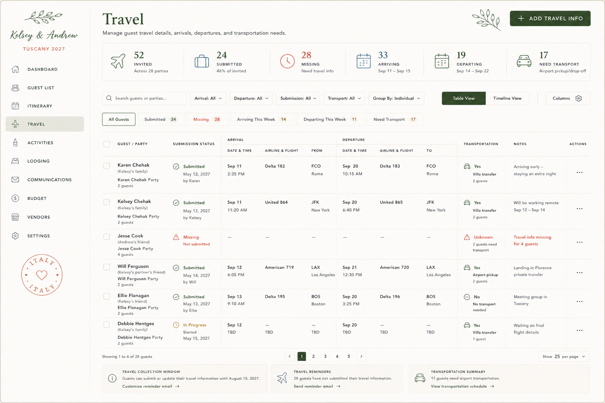

# Admin Spec — Travel

> **Status:** Captured 2026-07-20 — **not yet built.** Source: "Claude Code Implementation
> Brief — Admin Travel Page" + approved mockup (transcribed below; PNG not committed).
> **Maps to:** net-new page `/admin/travel`. Today only a `POST /api/admin/travel` route exists
> (`admin_upsert_travel_info`) with no UI and no sidebar entry.
> **Repo reconciliation (read before building):** this brief assumes Tailwind utility classes
> (`text-ink-500`, `size-4`), TanStack Table, React-Hook-Form + Zod, a `<PageTitle>`/`<Button>`
> component library, and **direct Supabase table reads**. This repo actually uses **CSS Modules**
> (co-located `*.module.css`), **Supabase RPCs** (`admin_*` functions, no ORM/direct table reads),
> and the **`app/admin/(dashboard)/`** route group with the sidebar defined in
> `app/admin/(dashboard)/layout.tsx`. Treat the brief as the source of truth for **layout, columns,
> states, data model, and behaviour** — but adapt the stack specifics on build. The rich
> `travel_itineraries` / `travel_segments` / `transportation_requests` model here supersedes the
> single flat `admin_upsert_travel_info` path.

## Mockup reference (transcribed)



Left sidebar (shared admin shell): "Kelsey & Andrew · TUSCANY 2027", nav = Dashboard, Guest List,
Itinerary, **Travel** (active), Activities, Lodging, Communications, Budget, Vendors, Settings;
terracotta Italy postmark at the bottom.

- **Header:** title "Travel"; subtitle "Manage guest travel details, arrivals, departures, and
  transportation needs."; olive sprig upper-right; forest-green **+ ADD TRAVEL INFO** button.
- **Metric strip (6):** `52 Invited` (Across 28 parties) · `24 Submitted` (46% of invited) ·
  `28 Missing` (Need travel info) · `33 Arriving` (Sep 11 – Sep 15) · `19 Departing`
  (Sep 14 – Sep 22) · `17 Need Transport` (Airport pickup/drop-off).
- **Toolbar:** Search guests or parties… · Arrival: All · Departure: All · Submission: All ·
  Transport: All · Group By: Individual · **Table View | Timeline View** · Columns.
- **Saved views:** All Guests · Submitted 24 · Missing 28 · Arriving This Week 14 ·
  Departing This Week 11 · Need Transport 17.
- **Table** (two-level header, Arrival + Departure grouped): Guest/Party, Submission Status,
  Arrival {Date & Time, Airline & Flight, From}, Departure {Date & Time, Airline & Flight, To},
  Transportation, Notes, Actions. Sample rows: Karen Chehak (Submitted May 12 by Karen · Sep 11
  2:35 PM Delta 182 FCO Rome · Sep 20 10:15 AM Delta 183 FCO Rome · Villa transfer 2 guests ·
  "Arriving early — staying an extra night"); Kelsey Chehak (United 864 JFK New York · Villa
  transfer); **Jesse Cook — Missing / Not submitted** (Unknown, 2 guests need transport, "Travel
  info missing for 4 guests"); Will Ferguson (American 719 LAX · Airport pickup); Ellie Flanagan
  (Delta 195 BOS · No transport needed); **Debbie Hentges — In Progress** (TBD, Villa transfer,
  "Waiting on final flight details").
- **Bottom cards (3):** Travel Collection Window ("submit or update … until August 15, 2027") ·
  Travel Reminders ("28 guests have not submitted") · Transportation Summary ("17 guests need
  airport transportation").
- **Pagination:** "Showing 1 to 6 of 28 guests" · pages 1–5 · Show 25 per page.

> ⚠️ **Wedding-fact discrepancy (do not copy verbatim):** the mockup uses **September 2027** travel
> dates and "TUSCANY 2027". Canonical per `CLAUDE.md` is **Tuscany, Italy · June 16–21, 2027**.
> Preserve the brief as reference, but reconcile dates on build. See `docs/admin/README.md`.

---
## CLAUDE CODE IMPLEMENTATION BRIEF

### Admin Travel Page

Build the next page in the private wedding-planning admin interface:

```
/admin/travel
```

The page must recreate the approved Travel admin mockup as closely as possible while using the existing:

Admin application shell

Left sidebar

Design tokens

Typography

Shared summary metric components

Shared filter controls

Supabase project

Guest and invitation-party records

Guest-detail drawers

URL-based filter state

Do not create a standalone design or duplicate guest records for travel.

The Travel page should function as the central operations hub for:

Guest travel-form submissions

Arrival and departure tracking

Flights, trains, and driving itineraries

Airport or station transfers

Transportation needs

Arrival-group planning

Missing travel reminders

Travel conflicts and incomplete submissions

Timeline-based logistics planning

## 1. ROUTE STRUCTURE

Create:

```
app/
  admin/
    travel/
      page.tsx
      loading.tsx
      error.tsx
```

Route:

```
/admin/travel
```

Optional future routes:

```
/admin/travel/timeline
/admin/travel/transportation
/admin/travel/import
```

For the first implementation, the table and timeline views should both live at /admin/travel and use URL parameters.

Examples:

```
/admin/travel?view=table
/admin/travel?view=timeline
/admin/travel?submission=missing
/admin/travel?transport=needed
```

Do not recreate the admin sidebar inside the Travel page. Use the existing:

```
app/admin/layout.tsx
```

## 2. PAGE COMPONENT STRUCTURE

Create:

```
components/
  admin/
    travel/
      TravelPageHeader.tsx
      TravelMetricStrip.tsx
      TravelToolbar.tsx
      TravelSavedViews.tsx
      TravelViewToggle.tsx
      TravelColumnPicker.tsx

      TravelTable.tsx
      TravelTableHeader.tsx
      TravelRow.tsx
      TravelGuestCell.tsx
      TravelSubmissionCell.tsx
      ArrivalSummaryCell.tsx
      DepartureSummaryCell.tsx
      TransportationCell.tsx
      TravelNotesCell.tsx
      TravelActionsMenu.tsx

      TravelTimelineView.tsx
      TravelTimelineDay.tsx
      TravelTimelineGroup.tsx
      TravelTimelineGuest.tsx

      TravelDetailDrawer.tsx
      TravelForm.tsx
      AddTravelInfoModal.tsx
      TravelReminderDialog.tsx
      TravelImportDialog.tsx
      TransportationPlanningDrawer.tsx

      TravelCollectionWindowCard.tsx
      TravelReminderSummaryCard.tsx
      TransportationSummaryCard.tsx
      TravelEmptyState.tsx
```

Create or extend:

```
types/
  travel.ts
```

Add:

```
lib/
  supabase/
    queries/
      travel.ts
    mutations/
      travel.ts

  travel/
    travel-status.ts
    travel-metrics.ts
    travel-filters.ts
    travel-conflicts.ts
    travel-grouping.ts
    travel-validation.ts
    travel-formatters.ts
```

Reuse existing shared components where possible:

PageTitle

SummaryMetricStrip

SearchField

SegmentedControl

FilterDropdown

StatusBadge

AttentionBadge

OverflowMenu

LoadingSkeleton

EmptyState

GuestDetailDrawer

Do not create duplicate generic versions of those components.

## 3. PAGE HEADER

Display:

Title:

Travel

Subtitle:

Manage guest travel details, arrivals, departures, and transportation needs.

Primary action:

+ Add Travel Info

The action opens a modal or drawer where an admin can select a guest and add or update that guest’s itinerary.

Example:

```
<PageTitle
  title="Travel"
  subtitle="Manage guest travel details, arrivals, departures, and transportation needs."
  action={
    <Button onClick={() => setAddTravelOpen(true)}>
      <Plus className="size-4" />
      Add Travel Info
    </Button>
  }
```

/>

Retain:

Forest-green title

Small olive-branch illustration near the upper right

Dark forest-green primary action

Existing spacing from the Guest List and Itinerary pages

## 4. PAGE LAYOUT

Use this vertical order:

Page header

Travel summary metric strip

Primary filter toolbar

Saved operational views

Travel table or travel timeline

Pagination

Operational summary cards

Travel detail drawer/modal

Suggested structure:

```
<div className="space-y-4">
  <TravelPageHeader />

  <TravelMetricStrip metrics={metrics} />

  <TravelToolbar
    filters={filters}
    view={view}
    groupBy={groupBy}
  />

  <TravelSavedViews
    activeView={activeSavedView}
    counts={savedViewCounts}
  />

  {view === 'table' ? (
    <TravelTable data={rows} />
  ) : (
    <TravelTimelineView data={timelineGroups} />
  )}

  <TravelPagination />

  <TravelOperationalCards />
</div>
```

## 5. SUMMARY METRIC STRIP

The approved mockup includes six metrics:

52 Invited

Across 28 parties

24 Submitted

46% of invited

28 Missing

Need travel info

33 Arriving

Sep 11 – Sep 15

19 Departing

Sep 14 – Sep 22

17 Need Transport

Airport pickup/drop-off

All values must be calculated from Supabase.

Do not hardcode the mockup numbers.

### Metric type

```
export interface TravelMetrics {
  invitedGuestCount: number;
  partyCount: number;

  submittedGuestCount: number;
  submittedPercentage: number;

  missingGuestCount: number;

  arrivingGuestCount: number;
  firstArrivalDate?: string | null;
  lastArrivalDate?: string | null;

  departingGuestCount: number;
  firstDepartureDate?: string | null;
  lastDepartureDate?: string | null;

  transportationNeededCount: number;
}
```

### Suggested icons

Invited: Plane

Submitted: Luggage

Missing: Clock3

Arriving: CalendarDays

Departing: CalendarRange

Need Transport: CarFront

Use:

Forest for invited and transport

Sky blue for submitted and arrivals

Terracotta for missing

Forest or sage for departures

### Metric actions

Clicking metrics should apply filters:

Invited

→ reset filters

Submitted

→ /admin/travel?submission=submitted

Missing

→ /admin/travel?submission=missing

Arriving

→ /admin/travel?arrival=has-arrival

Departing

→ /admin/travel?departure=has-departure

Need Transport

→ /admin/travel?transport=needed

## 6. PRIMARY FILTER TOOLBAR

Display one horizontal toolbar:

Search guests or parties…

Arrival: All

Departure: All

Submission: All

Transport: All

Group By: Individual

Table View | Timeline View

Columns

### Suggested widths

Search: 230px to 280px

Arrival: 110px

Departure: 120px

Submission: 125px

Transport: 120px

Group By: 150px

View toggle: 220px

Columns: 110px

Controls should match the Guest List controls:

Height: 36px

Background: white

Border: 1px solid warm beige

Radius: 6px

Font size: 11px

### Search behavior

Search:

Guest name

Party name

Email

Phone

Airline

Flight number

Arrival airport or station

Departure airport or station

City

Transportation note

Use URL state:

search

arrival

departure

submission

transport

group

view

columns

page

pageSize

sort

Example:

```
/admin/travel?view=table&submission=missing&transport=needed
```

## 7. GROUPING OPTIONS

The Group By selector should support:

Individual

Party

Arrival Date

Departure Date

Arrival Location

Transportation Group

Initial default:

Individual

### Individual grouping

One row per guest or primary traveler record.

### Party grouping

One grouped section per invitation party. Show all party members and indicate whether they share an itinerary.

### Arrival Date grouping

Group guests under dates:

Thursday, September 11

Friday, September 12

Saturday, September 13

### Arrival Location grouping

Examples:

FCO — Rome Fiumicino

FLR — Florence

PSA — Pisa

Firenze Santa Maria Novella

Driving

Unknown

## 8. SAVED OPERATIONAL VIEWS

Directly beneath the toolbar, show:

All Guests

Submitted 24

Missing 28

Arriving This Week 14

Departing This Week 11

Need Transport 17

These should be clickable filter presets.

Suggested URL mappings:

All Guests

```
/admin/travel
```

Submitted

```
/admin/travel?submission=submitted
```

Missing

```
/admin/travel?submission=missing
```

Arriving This Week

```
/admin/travel?arrivalWindow=this-week
```

Departing This Week

```
/admin/travel?departureWindow=this-week
```

Need Transport

```
/admin/travel?transport=needed
```

Selected saved view:

Fine forest border

Warm-white background

Dark forest text

Counts may use subtle small circular count markers, not large pills.

## 9. TABLE STRUCTURE

Use grouped headers for arrival and departure.

Main columns:

Select

Guest / Party

Submission Status

Arrival

  Date & Time

  Airline & Flight

  From

Departure

  Date & Time

  Airline & Flight

  To

Transportation

Notes

Actions

Recommended widths:

Select: 36px

Guest / Party: 180px

Submission Status: 145px

Arrival Date & Time: 105px

Arrival Airline & Flight: 125px

Arrival From: 105px

Departure Date & Time: 105px

Departure Airline & Flight: 125px

Departure To: 105px

Transportation: 135px

Notes: 165px

Actions: 52px

Table minimum width:

Approximately 1420px to 1500px

Allow horizontal scrolling below that width.

The approved design is intentionally dense. Do not stack the columns on standard desktop screens.

## 10. TABLE HEADER

Use a two-level header.

Example:

```
<thead>
  <tr>
    <th rowSpan={2}>...</th>
    <th rowSpan={2}>Guest / Party</th>
    <th rowSpan={2}>Submission Status</th>
    <th colSpan={3}>Arrival</th>
    <th colSpan={3}>Departure</th>
    <th rowSpan={2}>Transportation</th>
    <th rowSpan={2}>Notes</th>
    <th rowSpan={2}>Actions</th>
  </tr>

  <tr>
    <th>Date & Time</th>
    <th>Airline & Flight</th>
    <th>From</th>
    <th>Date & Time</th>
    <th>Airline & Flight</th>
    <th>To</th>
  </tr>
</thead>
```

Header styling:

Uppercase

10px

Slightly tracked

Warm neutral text

Fine horizontal and vertical dividers

Keep Arrival and Departure centered over their column groups.

## 11. ROW HEIGHT AND STYLING

Recommended row height:

94px to 108px

Use:

Warm-white background

Thin horizontal separators

Selective vertical dividers between major groups

No heavy card border around each row

No zebra striping

No strong shadows

Use hover:

```
background: var(--admin-surface-soft);
```

The whole row may be clickable, except interactive controls.

## 12. GUEST / PARTY CELL

Display:

Karen Chehak

(Kelsey’s family)

Karen Chehak Party

2 guests

Hierarchy:

Guest name:

12.5px to 13px

Medium weight

Dark ink

Relationship:

10px

Muted

Party name:

10.5px

Dark neutral

Party count:

10px

Muted

Example:

```
<div>
  <button className="font-medium hover:underline">
    Karen Chehak
  </button>
  <p className="text-[10px] text-ink-500">
    (Kelsey’s family)
  </p>
  <p className="mt-1 text-[10.5px] text-ink-700">
    Karen Chehak Party
  </p>
  <p className="text-[10px] text-ink-500">
    2 guests
  </p>
</div>
```

Clicking the guest name opens the existing guest drawer.

Clicking the party name opens the existing party drawer.

## 13. SUBMISSION STATUS CELL

Support:

Submitted

In Progress

Missing

Not Required

Admin Entered

Needs Review

### Submitted

✓ Submitted

May 12, 2027

by Karen

Color: forest green.

### In Progress

◷ In Progress

Started

May 15, 2027

Color: citrus gold.

### Missing

△ Missing

Not submitted

Color: terracotta.

### Admin Entered

✓ Admin Entered

May 14, 2027

by Kelsey

Color: sky blue or forest.

### Needs Review

Use when:

Arrival information exists but departure is missing

A flight number is malformed

Location is unknown

A travel conflict is detected

Transportation needs are ambiguous

Example:

△ Needs Review

Departure incomplete

## 14. ARRIVAL CELLS

### Arrival Date & Time

Display:

Sep 11

2:35 PM

If not available:

—

If only date is known:

Sep 11

Time TBD

If arrival mode is driving:

Sep 11

Approx. 4:00 PM

### Arrival Airline & Flight

Display:

Delta 182

Other supported modes:

Train 9411

Rental car

Driving

Private transfer

Ferry

TBD

The data model must not assume all guests are flying.

### From

Display:

FCO

Rome

Or:

JFK

New York

Or:

Firenze SMN

Florence

Structure:

Code or station short name

City beneath

## 15. DEPARTURE CELLS

Mirror the arrival structure.

### Departure Date & Time

Sep 20

10:15 AM

### Departure Airline & Flight

Delta 183

### To

FCO

Rome

The To field represents the departure airport, station, or next destination as entered by the guest.

If the current schema uses departure_location, keep the label in the UI as To, matching the approved mockup.

## 16. TRANSPORTATION CELL

Support these states:

Yes

No

Unknown

Not Required

Assigned

Waitlisted

Examples:

### Transportation needed

[car icon] Yes

Villa transfer

2 guests

### Airport pickup

[car icon] Yes

Airport pickup

2 guests

### No transportation required

[minus icon] No

No transport needed

### Unknown

[warning icon] Unknown

2 guests need transport

### Assigned

[check icon] Assigned

Transfer Group A

2 guests

Transportation modes:

Airport pickup

Airport drop-off

Train-station pickup

Train-station drop-off

Villa transfer

Shared shuttle

Private car

Rental car

Self-driving

Taxi

No transport required

Unknown

## 17. NOTES CELL

Display concise travel notes with a maximum of approximately three lines.

Examples:

Arriving early —

staying an extra night

Will be working remote

Sep 12 – Sep 14

Landing in Florence

private transfer

Waiting on final

flight details

Use truncation and a tooltip or drawer for full notes.

Do not expose sensitive passport numbers, full document scans, or other unnecessary identity information in the table.

## 18. ACTIONS MENU

Each row has a three-dot overflow menu.

Actions:

View travel details

Edit travel details

Open guest profile

Open party

Assign transportation

Send travel reminder

Mark not required

Copy itinerary

Clear travel submission

View submission history

Destructive actions require confirmation:

Clear travel submission

Delete travel record

Copy itinerary should support copying one guest’s itinerary to selected members of the same party.

This is useful when couples or families travel together.

## 19. SHARED AND INDIVIDUAL ITINERARIES

The schema and UI must support both:

Party members share one itinerary

Party members have separate itineraries

Do not permanently store travel only at party level.

Each travel itinerary should relate to one or more guests.

Recommended model:

travel_itineraries

travel_itinerary_guests

travel_segments

transportation_requests

This is more flexible than storing one arrival and departure record directly on each guest.

For backward compatibility, existing travel_submissions records may be migrated or adapted.

## 20. RECOMMENDED TRAVEL DATA MODEL

### Travel itineraries

```
create table if not exists travel_itineraries (
  id uuid primary key default gen_random_uuid(),

  party_id uuid references invitation_parties(id) on delete set null,

  submission_status text not null default 'missing',
  submitted_by_guest_id uuid references guests(id) on delete set null,
  submitted_by_name text,
  source text not null default 'guest',

  notes text,
  admin_notes text,

  submitted_at timestamptz,
  started_at timestamptz,
  updated_at timestamptz not null default now(),
  created_at timestamptz not null default now()
);
```

Suggested submission_status values:

missing

in_progress

submitted

admin_entered

needs_review

not_required

Constraint:

```
alter table travel_itineraries
```

add constraint travel_itineraries_submission_status_check

```
check (
  submission_status in (
    'missing',
    'in_progress',
    'submitted',
    'admin_entered',
    'needs_review',
    'not_required'
  )
);
```

### Itinerary guests

```
create table if not exists travel_itinerary_guests (
  id uuid primary key default gen_random_uuid(),

  itinerary_id uuid not null
    references travel_itineraries(id)
    on delete cascade,

  guest_id uuid not null
    references guests(id)
    on delete cascade,

  created_at timestamptz not null default now(),

  unique (itinerary_id, guest_id)
);
```

This allows one itinerary to cover:

One guest

A couple

An entire family

Selected members of a party

## 21. TRAVEL SEGMENTS

Use a segment-based structure so the platform can support flights, trains, driving, and transfers.

```
create table if not exists travel_segments (
  id uuid primary key default gen_random_uuid(),

  itinerary_id uuid not null
    references travel_itineraries(id)
    on delete cascade,

  direction text not null,
  segment_type text not null,
  segment_order integer not null default 0,

  departure_location_code text,
  departure_location_name text,
  departure_city text,
  departure_at timestamptz,

  arrival_location_code text,
  arrival_location_name text,
  arrival_city text,
  arrival_at timestamptz,

  carrier_name text,
  carrier_code text,
  service_number text,

  confirmation_number text,
  notes text,

  created_at timestamptz not null default now(),
  updated_at timestamptz not null default now()
);
```

Suggested directions:

arrival

departure

internal

Suggested segment types:

flight

train

car

rental_car

private_transfer

shared_shuttle

taxi

ferry

bus

other

Constraints:

```
alter table travel_segments
```

add constraint travel_segments_direction_check

```
check (
  direction in (
    'arrival',
    'departure',
    'internal'
  )
);
alter table travel_segments
```

add constraint travel_segments_type_check

```
check (
  segment_type in (
    'flight',
    'train',
    'car',
    'rental_car',
    'private_transfer',
    'shared_shuttle',
    'taxi',
    'ferry',
    'bus',
    'other'
  )
);
```

The table should display the first relevant arrival segment and final relevant departure segment.

The drawer should show every segment.

## 22. TRANSPORTATION REQUESTS

Create:

```
create table if not exists transportation_requests (
  id uuid primary key default gen_random_uuid(),

  itinerary_id uuid
    references travel_itineraries(id)
    on delete cascade,

  guest_id uuid
    references guests(id)
    on delete cascade,

  request_type text not null,
  requested boolean not null default false,

  pickup_location text,
  pickup_at timestamptz,
  dropoff_location text,

  passenger_count integer not null default 1,
  luggage_count integer,
  accessibility_notes text,

  assignment_status text not null default 'unassigned',
  transportation_group_id uuid,

  guest_notes text,
  admin_notes text,

  created_at timestamptz not null default now(),
  updated_at timestamptz not null default now()
);
```

Request types:

airport_pickup

airport_dropoff

station_pickup

station_dropoff

villa_transfer

shared_shuttle

private_car

none

unknown

Assignment statuses:

unassigned

assigned

confirmed

waitlisted

cancelled

not_required

## 23. TRANSPORTATION GROUPS

Create:

```
create table if not exists transportation_groups (
  id uuid primary key default gen_random_uuid(),

  name text not null,
  group_type text not null,

  pickup_location text,
  dropoff_location text,
  scheduled_pickup_at timestamptz,

  vehicle_type text,
  vehicle_capacity integer,
  driver_name text,
  driver_phone text,
  vendor_id uuid,

  status text not null default 'draft',
  notes text,

  created_at timestamptz not null default now(),
  updated_at timestamptz not null default now()
);
```

Examples:

FCO Transfer Group A

Florence Station Pickup 1

Wedding Day Villa Shuttle

Departure Shuttle B

Do not show the driver’s phone number in the main travel table.

## 24. TYPESCRIPT TYPES

Create:

```
export type TravelSubmissionStatus =
  | 'missing'
  | 'in_progress'
  | 'submitted'
  | 'admin_entered'
  | 'needs_review'
  | 'not_required';

export type TravelSegmentType =
  | 'flight'
  | 'train'
  | 'car'
  | 'rental_car'
  | 'private_transfer'
  | 'shared_shuttle'
  | 'taxi'
  | 'ferry'
  | 'bus'
  | 'other';

export type TravelDirection =
  | 'arrival'
  | 'departure'
  | 'internal';

export type TransportationAssignmentStatus =
  | 'unassigned'
  | 'assigned'
  | 'confirmed'
  | 'waitlisted'
  | 'cancelled'
  | 'not_required';
export interface TravelSegment {
  id: string;
  direction: TravelDirection;
  segmentType: TravelSegmentType;
  segmentOrder: number;

  departureLocationCode?: string | null;
  departureLocationName?: string | null;
  departureCity?: string | null;
  departureAt?: string | null;

  arrivalLocationCode?: string | null;
  arrivalLocationName?: string | null;
  arrivalCity?: string | null;
  arrivalAt?: string | null;

  carrierName?: string | null;
  carrierCode?: string | null;
  serviceNumber?: string | null;
  notes?: string | null;
}
export interface TravelTransportationSummary {
  requested: boolean | null;
  requestType?: string | null;
  passengerCount: number;
  assignmentStatus: TransportationAssignmentStatus;
  groupId?: string | null;
  groupName?: string | null;
}
export interface TravelTableRow {
  itineraryId?: string | null;

  guestId: string;
  guestName: string;
  relationshipLabel?: string | null;

  partyId: string;
  partyName: string;
  partyGuestCount: number;

  coveredGuestIds: string[];
  coveredGuestCount: number;

  submissionStatus: TravelSubmissionStatus;
  submittedAt?: string | null;
  submittedByName?: string | null;
  startedAt?: string | null;

  arrival?: TravelSegment | null;
  departure?: TravelSegment | null;

  transportation?: TravelTransportationSummary | null;

  notes?: string | null;
  attentionItems: TravelAttentionItem[];
}
export interface TravelAttentionItem {
  id: string;
  type:
    | 'missing_submission'
    | 'incomplete_arrival'
    | 'incomplete_departure'
    | 'unknown_transportation'
    | 'unassigned_transportation'
    | 'arrival_conflict'
    | 'departure_conflict'
    | 'lodging_date_conflict'
    | 'late_arrival'
    | 'early_departure'
    | 'duplicate_itinerary';
  severity: 'neutral' | 'warning' | 'critical';
  label: string;
}
```

## 25. QUERY STRATEGY

Create a server-side page query:

```
export async function getTravelPageData(
  filters: TravelPageFilters
): Promise<{
  rows: TravelTableRow[];
  metrics: TravelMetrics;
  savedViewCounts: TravelSavedViewCounts;
  timelineGroups: TravelTimelineGroup[];
  transportationGroups: TransportationGroupSummary[];
}> {
  // Fetch and normalize all travel-related records.
}
```

Fetch in a small number of requests:

const [

  guestsResult,

  partiesResult,

  itinerariesResult,

  itineraryGuestsResult,

  segmentsResult,

  requestsResult,

  transportGroupsResult,

  lodgingResult,

] = await Promise.all([

  getGuests(),

  getInvitationParties(),

  getTravelItineraries(),

  getTravelItineraryGuests(),

  getTravelSegments(),

  getTransportationRequests(),

  getTransportationGroups(),

  getLodgingAssignments(),

```
]);
```

Do not issue one Supabase request for each table row.

Aggregate on the server.

## 26. TRAVEL ROW DERIVATION

For each attending or invited guest:

Locate the itinerary connected through travel_itinerary_guests.

Determine the earliest arrival segment relevant to the wedding destination.

Determine the final departure segment leaving the destination.

Derive submission status.

Derive transportation request and assignment.

Compare itinerary dates with lodging dates.

Generate attention items.

Format the result into a TravelTableRow.

Do not treat a guest as complete merely because any travel record exists.

Completion should require the configured required fields.

## 27. SUBMISSION COMPLETENESS RULES

Create:

```
lib/travel/travel-status.ts
```

Suggested logic:

```
export function deriveTravelSubmissionStatus(
  itinerary: TravelItinerary | null,
  segments: TravelSegment[]
): TravelSubmissionStatus {
  if (!itinerary) return 'missing';

  if (itinerary.submissionStatus === 'not_required') {
    return 'not_required';
  }

  if (itinerary.submissionStatus === 'admin_entered') {
    return 'admin_entered';
  }

  const arrival = segments.find(
    segment => segment.direction === 'arrival'
  );

  const departure = segments.find(
    segment => segment.direction === 'departure'
  );

  if (!arrival && !departure) {
    return itinerary.startedAt ? 'in_progress' : 'missing';
  }

  if (!arrival || !departure) {
    return 'needs_review';
  }

  return 'submitted';
}
```

Make required travel fields configurable.

Example:

```
export interface TravelCollectionRequirements {
  requireArrival: boolean;
  requireDeparture: boolean;
  requireTransportationAnswer: boolean;
  requireArrivalTime: boolean;
  requireDepartureTime: boolean;
}
```

## 28. CONFLICT AND ATTENTION RULES

Create:

```
lib/travel/travel-conflicts.ts
```

Generate automatic warnings for:

Attending guest has no travel submission

Arrival date is after first required event

Departure is before final required event

Arrival occurs after assigned transport pickup

Departure occurs before assigned lodging checkout

Lodging begins after arrival

Lodging ends before departure

Transportation requested but not assigned

Transportation marked unknown

Flight or train location missing

Duplicate itineraries assigned to the same guest

Party members appear to share travel but records differ

Example:

```
export function getTravelAttentionItems(
  row: TravelTableRow,
  context: TravelConflictContext
): TravelAttentionItem[] {
  const items: TravelAttentionItem[] = [];

  if (row.submissionStatus === 'missing') {
    items.push({
      id: `missing-${row.guestId}`,
      type: 'missing_submission',
      severity: 'warning',
      label: 'Travel information missing',
    });
  }

  if (
    row.transportation?.requested &&
    row.transportation.assignmentStatus === 'unassigned'
  ) {
    items.push({
      id: `transport-${row.guestId}`,
      type: 'unassigned_transportation',
      severity: 'warning',
      label: 'Transportation not assigned',
    });
  }

  return items;
}
```

Warnings should surface in:

Transportation cell

Notes or status

Guest detail drawer

Dashboard Needs Attention

Travel reminder workflows

## 29. TABLE VIEW

Default:

```
/admin/travel?view=table
```

Use TanStack Table if already installed for Guest List.

Support:

Sorting

Column visibility

Pagination

Row selection

Bulk actions

URL-persisted filters

Horizontal scrolling

Sticky table header

Optional sticky Guest/Party column

Recommended sticky columns:

Checkbox

Guest / Party

Submission Status

Do not make every column sticky.

## 30. TIMELINE VIEW

Route state:

```
/admin/travel?view=timeline
```

The timeline should show arrivals and departures chronologically.

### Timeline grouping

Group by date:

THURSDAY, SEPTEMBER 11

FRIDAY, SEPTEMBER 12

SATURDAY, SEPTEMBER 13

Within each date, group by location or time.

Example:

SEPTEMBER 11

11:20 AM

FCO — Rome Fiumicino

Kelsey Chehak + Andrew Shults

United 864

2 travelers

Villa transfer assigned

2:35 PM

FCO — Rome Fiumicino

Karen Chehak + Debbie Hentges

Delta 182

2 travelers

Transport needed

### Timeline filters

Arrivals

Departures

Both

Transportation needed

Location

Date range

### Timeline use

This view supports:

Airport-transfer planning

Grouping guests by arrival window

Seeing overlapping arrivals

Identifying pickup opportunities

Spotting transfer conflicts

Planning departure shuttles

It is not a decorative guest-facing timeline.

## 31. BULK ACTIONS

When rows are selected, show a compact bulk-action toolbar:

6 selected

Send travel reminder

Assign transportation

Mark not required

Export selected

Add admin note

Clear selection

Do not place bulk actions permanently in the main toolbar unless rows are selected.

## 32. TRAVEL REMINDERS

Create:

```
TravelReminderDialog.tsx
```

The dialog should support:

Audience

- All missing

- In progress

- Missing arrival

- Missing departure

- Transportation unknown

- Selected guests

Delivery

- Email

- SMS, when available

- Both

Template

- Initial travel request

- Friendly reminder

- Final reminder

- Transportation follow-up

- Custom message

For the initial build, sending may integrate with the existing communications system or remain a clearly labeled draft/queue action.

Do not claim reminders were sent unless the sending integration is active.

## 33. ADD TRAVEL INFO MODAL

The Add Travel Info action should first ask:

Who is this itinerary for?

Allow:

Search guests

Select one guest

Select multiple party members

Select entire party

Then display the travel form.

Form sections:

Travelers

Submission status

Arrival

Departure

Additional segments

Transportation

Lodging coordination

Guest notes

Admin notes

## 34. TRAVEL FORM

Use React Hook Form and Zod.

Suggested high-level schema:

```
const travelFormSchema = z.object({
  guestIds: z.array(z.string().uuid()).min(1),

  submissionStatus: z.enum([
    'missing',
    'in_progress',
    'submitted',
    'admin_entered',
    'needs_review',
    'not_required',
  ]),

  arrival: z
    .object({
      segmentType: z.string(),
      departureLocationCode: z.string().optional(),
      departureLocationName: z.string().optional(),
      departureCity: z.string().optional(),
      departureAt: z.string().optional(),

      arrivalLocationCode: z.string().optional(),
      arrivalLocationName: z.string().optional(),
      arrivalCity: z.string().optional(),
      arrivalAt: z.string().optional(),

      carrierName: z.string().optional(),
      serviceNumber: z.string().optional(),
      notes: z.string().optional(),
    })
    .optional(),

  departure: z
    .object({
      segmentType: z.string(),
      departureLocationCode: z.string().optional(),
      departureLocationName: z.string().optional(),
      departureCity: z.string().optional(),
      departureAt: z.string().optional(),

      arrivalLocationCode: z.string().optional(),
      arrivalLocationName: z.string().optional(),
      arrivalCity: z.string().optional(),
      arrivalAt: z.string().optional(),

      carrierName: z.string().optional(),
      serviceNumber: z.string().optional(),
      notes: z.string().optional(),
    })
    .optional(),

  transportation: z.object({
    requested: z.boolean().nullable(),
    requestType: z.string().optional(),
    passengerCount: z.number().int().min(1),
    luggageCount: z.number().int().min(0).optional(),
    pickupLocation: z.string().optional(),
    pickupAt: z.string().optional(),
    dropoffLocation: z.string().optional(),
    guestNotes: z.string().optional(),
    adminNotes: z.string().optional(),
  }),

  notes: z.string().max(2000).optional(),
  adminNotes: z.string().max(4000).optional(),
});
```

Validation should depend on segment type.

Example:

Flight: airline and flight number may be required when marked submitted

Train: train number is optional but station and time should be required

Driving: approximate arrival time may be accepted

Not required: arrival and departure may be blank

## 35. TRAVEL DETAIL DRAWER

Clicking a row opens a right-side drawer.

Width:

600px to 680px

Tabs:

Overview

Itinerary

Transportation

Guest & Party

History

### Overview

Display:

Guest or travelers

Party

Submission status

Submitted by

Submitted date

Travel-completeness state

Warnings

Notes

### Itinerary

Show every travel segment in order:

JFK → FCO

Flight

FCO → Florence

Train

Florence → Villa Rosa

Private transfer

Allow:

Add segment

Edit segment

Reorder segment

Remove segment

### Transportation

Display:

Transportation requested

Pickup/drop-off request

Passenger count

Luggage count

Assignment

Transfer group

Pickup time

Pickup location

Driver/vendor

Admin notes

### Guest & Party

Show party members and indicate which share this itinerary.

Allow:

Add party member to itinerary

Remove traveler

Copy itinerary to another traveler

Split traveler into separate itinerary

### History

Display:

Guest submitted travel

Guest updated arrival

Admin assigned transfer group

Admin changed pickup time

Reminder sent

## 36. BOTTOM OPERATIONAL CARDS

The approved mockup has three compact cards beneath the table.

### Card 1: Travel Collection Window

Display:

TRAVEL COLLECTION WINDOW

Guests can submit or update their travel

information until August 15, 2027.

Customize reminder email →

This should use settings from a travel-collection configuration table.

### Card 2: Travel Reminders

Display:

TRAVEL REMINDERS

28 guests have not submitted

their travel information.

Send reminder email →

Clicking opens TravelReminderDialog.

### Card 3: Transportation Summary

Display:

TRANSPORTATION SUMMARY

17 guests need airport transportation.

View transportation schedule →

Clicking may:

Switch to timeline filtered by transport needed, or

Open TransportationPlanningDrawer

Recommended:

```
/admin/travel?view=timeline&transport=needed
```

## 37. TRAVEL COLLECTION SETTINGS

Create or reuse a wedding settings table.

Recommended:

```
create table if not exists travel_collection_settings (
  id uuid primary key default gen_random_uuid(),

  collection_open boolean not null default false,
  collection_opens_at timestamptz,
  collection_closes_at timestamptz,

  require_arrival boolean not null default true,
  require_departure boolean not null default true,
  require_transportation_answer boolean not null default true,

  allow_guest_updates boolean not null default true,

  reminder_template_id uuid,

  created_at timestamptz not null default now(),
  updated_at timestamptz not null default now()
);
```

The page should display the active collection window.

## 38. PAGINATION

Match the approved mockup.

Left:

Showing 1 to 6 of 28 guests

Center:

‹ 1 2 3 4 5 ›

Right:

Show 25 per page

Support:

10

25

50

100

Persist:

page

pageSize

in URL state.

## 39. COLUMN PICKER

The Columns button opens a menu.

Default visible columns:

Guest / Party

Submission Status

Arrival Date & Time

Arrival Airline & Flight

Arrival From

Departure Date & Time

Departure Airline & Flight

Departure To

Transportation

Notes

Actions

Optional columns:

Email

Phone

Relationship

Party size

Traveler count

Arrival mode

Departure mode

Transportation assignment

Lodging

Submission source

Submitted date

Last updated

Needs attention

Allow:

Show/hide

Reset defaults

Optional reorder later

Persist preference in local storage initially or user settings if available.

## 40. EXPORTS

Support:

Export visible rows as CSV

Export selected rows as CSV

Export transportation manifest

Export arrival schedule

Export departure schedule

Print timeline

Recommended CSV fields:

Guest name

Party

Submission status

Traveler count

Arrival date

Arrival time

Arrival location

Arrival city

Arrival carrier

Arrival service number

Departure date

Departure time

Departure location

Departure city

Departure carrier

Departure service number

Transportation needed

Transportation type

Transportation assignment

Notes

## 41. MUTATIONS

Create server actions or route handlers for:

Create itinerary

Update itinerary

Delete itinerary

Add traveler to itinerary

Remove traveler from itinerary

Split itinerary

Copy itinerary

Create travel segment

Update travel segment

Delete travel segment

Reorder travel segments

Create transportation request

Update transportation request

Assign transportation group

Mark travel not required

Update submission status

Add admin note

After mutations:

```
revalidatePath('/admin/travel');
revalidatePath('/admin/guests');
revalidatePath('/admin/dashboard');
```

If travel summaries appear on the guest-facing site, also revalidate the relevant guest route.

## 42. RELATIONSHIP TO GUEST RSVP FORMS

Travel data submitted through the guest-facing site must write to the same underlying travel tables used by the admin page.

Do not create separate:

guest travel form data

admin travel data

The same records should support both.

Guest submissions should create or update:

travel_itineraries

travel_itinerary_guests

travel_segments

transportation_requests

guest_activity_log

Preserve:

Submitted by

Submission source

Submitted date

Last updated date

Admin changes

Guest changes

## 43. ACTIVITY LOG

When travel changes, create entries in the existing guest activity log.

Examples:

travel_started

travel_submitted

travel_updated

travel_admin_entered

transportation_requested

transportation_assigned

transportation_updated

travel_reminder_sent

travel_marked_not_required

This activity feeds:

Dashboard recent submissions

Guest change history

Travel drawer history

Future notifications

## 44. SAMPLE DATA

Seed rows demonstrating:

### Complete submitted itinerary

Karen Chehak

Submitted

Sep 11 · 2:35 PM

Delta 182

FCO · Rome

Sep 20 · 10:15 AM

Delta 183

FCO · Rome

Villa transfer

2 guests

### Complete itinerary from the US

Kelsey Chehak

Submitted

Sep 11 · 11:20 AM

United 864

JFK · New York

Sep 20 · 6:40 PM

United 865

JFK · New York

Villa transfer

2 guests

### Missing party travel

Jesse Cook

Missing

No arrival

No departure

Transportation unknown

Travel info missing for 4 guests

### Airport pickup needed

Will Ferguson

Submitted

Sep 12 · 4:05 PM

American 719

LAX · Los Angeles

Sep 21 · 12:30 PM

American 720

LAX · Los Angeles

Airport pickup

2 guests

### No transport needed

Ellie Flanagan

Submitted

Sep 13 · 9:10 AM

Delta 195

BOS · Boston

Sep 20 · 3:25 PM

Delta 196

BOS · Boston

No transport needed

### In-progress itinerary

Debbie Hentges

In Progress

Sep 12 · Time TBD

Airline TBD

Departure Sep 20 · Time TBD

Villa transfer requested

Waiting on final flight details

## 45. LOADING STATE

Use skeletons matching:

Six summary metrics

Filter toolbar

Saved views

Six table rows

Three bottom operational cards

Do not use a full-page spinner.

## 46. EMPTY STATES

### No invited guests

There are no guests available for travel tracking yet.

### No travel submissions

Travel collection has not started yet.

Open the collection window or add an itinerary manually.

Actions:

Open Travel Collection

Add Travel Info

### No filtered results

No guests match these travel filters.

Action:

Clear Filters

## 47. ERROR STATES

Handle:

Failed query

Failed itinerary save

Failed segment update

Duplicate traveler assignment

Invalid date order

Transportation capacity exceeded

Guest already belongs to another shared itinerary

Submission history unavailable

Errors should use terracotta and plain-language messaging.

Do not use bright red page-wide banners unless the entire page cannot load.

## 48. RESPONSIVE BEHAVIOR

### Large desktop

Match the approved mockup closely.

### Medium desktop

Keep the sidebar

Allow table horizontal scroll

Metric strip may wrap into 3 + 3

Toolbar may wrap to two rows

### Tablet

Below approximately 900px:

Collapse the sidebar

Use travel cards rather than the full table

Keep table view available through horizontal scroll if practical

Make the timeline the preferred logistics view

### Mobile card

Display:

Guest

Submission status

Arrival

Departure

Transportation

Attention state

The approved desktop design remains the primary acceptance target.

## 49. VISUAL REQUIREMENTS

Match the approved Travel mockup using the established admin design system.

Retain:

Warm cream background

Warm-white table surface

Forest-green editorial page title

Fine beige borders

No strong shadows

Thin line icons

Sky-blue arrival and submission accents

Terracotta missing and warning states

Forest-green positive and transport states

Small uppercase table headers

Dense horizontal information layout

Decorative olive branch only near the header

Terracotta Italy postmark in the shared sidebar

Do not:

Use a generic travel-booking aesthetic

Add airline-brand colors

Use large illustrated planes

Turn every field into a pill

Add excessive botanical decoration

Use bright error red

Hide key travel information in drawers

Require opening every guest to see arrival, departure, or transport status

## 50. ACCESSIBILITY

Implement:

Semantic table headers

Keyboard-accessible filters and menus

Focus-visible styles

Text labels in addition to status colors

Accessible modal and drawer focus trapping

Proper field labels

Confirmation for destructive actions

Tooltips that are keyboard-accessible

aria-label for icon-only actions

Status announcements after save

## 51. IMPLEMENTATION ORDER

Build in this order:

1. Travel database migration

2. TypeScript domain types

3. Supabase query layer

4. Travel row normalization

5. Travel metric calculations

6. Page header and summary strip

7. Filters and URL state

8. Saved operational views

9. Table header and row cells

10. Pagination and column picker

11. Travel detail drawer

12. Add/Edit travel form

13. Transportation requests

14. Timeline view

15. Attention and conflict rules

16. Bulk reminders and assignments

17. Bottom operational cards

18. Exports

19. Loading, empty, and error states

20. Responsive behavior

21. Final visual polish

## 52. ACCEPTANCE CRITERIA

The page is complete when:

/admin/travel uses the existing admin shell

The layout closely matches the approved Travel mockup

Six travel metrics come from Supabase

Each guest’s submission status is visible

Arrival and departure information are visible without opening a drawer

The page supports flights, trains, driving, and transfers

Shared party itineraries and separate individual itineraries both work

Transportation needs and assignments are visible

Missing and incomplete submissions are automatically identified

Filters persist in the URL

Saved views apply operational filters

Table and timeline views share the same underlying data

Admins can create and edit itineraries

Guest travel forms write to the same travel records

Transportation requests can be assigned to groups

Dashboard and Guest List travel summaries update from the same data

The page remains usable on narrower desktop screens

Styling remains consistent with Dashboard, Guest List, and Itinerary pages

## 53. FINAL CLAUDE RESPONSE

After implementation, provide:

1. Files created

2. Files modified

3. SQL migrations added

4. Packages installed

5. Existing schema that was reused

6. Data migration or compatibility decisions

7. Features connected to Supabase

8. Features still using sample data

9. URL filters implemented

10. Steps to test a guest travel submission

11. Steps to test a shared party itinerary

12. Steps to test transportation assignment

13. Steps to verify dashboard and guest-list synchronization

Do not describe features as complete if they remain hardcoded, disconnected, or mock-only.
