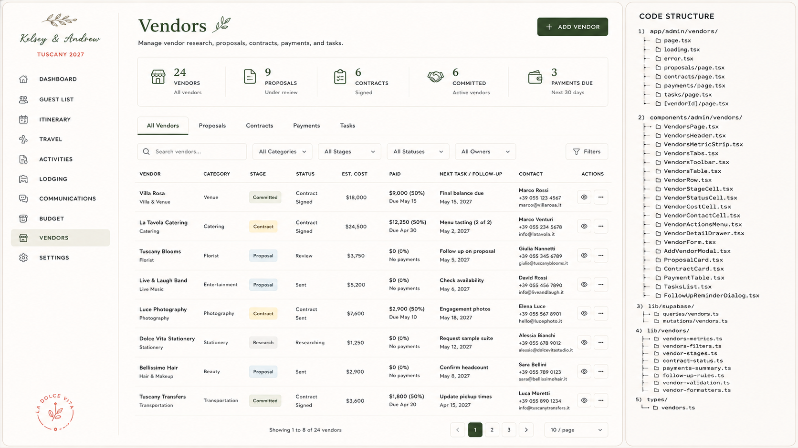

# Admin Spec — Vendors

> **Status:** Captured 2026-07-20; **built 2026-07-21** (`app/admin/(dashboard)/vendors/`).
> Source: bundled "Claude Code Implementation Brief — Admin Vendors Page" (brief 4 of 4) + mockup.
>
> **What was built:** the list page rebuilt onto the shared admin shell (PageHeader, metric strip,
> toolbar, table, pagination) with five tabs — All Vendors · Proposals · Contracts · Payments ·
> Tasks; proposal + contract state on the vendor with a derived single-line **Status**; a
> `vendor_tasks` follow-up list with overdue highlighting; and **contracted/paid figures rolled up
> from the Budget** (see D18) rather than stored again here.
>
> **Deliberate deviations:** proposals and contracts are **columns on `vendors`, not tables** — one
> vendor has one proposal and one contract, which is exactly what the mockup's single Status column
> shows; two extra tables would buy versioning nobody asked for. **Not built:** proposal comparison,
> document storage against a vendor (Venues has it; Vendors doesn't yet), and **Gmail ingest** —
> that is its own unbuilt spec, and nothing here should imply mail is being read.
> **Maps to:** existing **Vendors** page `app/admin/(dashboard)/vendors/` (`VendorForm.tsx`,
> `vendors/[id]/`, RPCs `admin_list_vendors`, `admin_upsert_vendor`, `admin_delete_vendor`,
> `admin_add_vendor_communication`). This brief is a **large expansion** — vendor lifecycle stages,
> proposals, contracts, payments, tasks, proposal comparison, budget + Gmail integration.
> **Repo reconciliation (read before building):** brief assumes Tailwind + TanStack + direct
> Supabase reads; repo uses **CSS Modules** + **Supabase RPCs** under `app/admin/(dashboard)/`.
> Extend the existing vendor RPC surface rather than switching to direct table reads. Mockup's
> **"Code Structure" panel** lists the intended file tree (`components/admin/vendors/*`,
> `lib/supabase/queries|mutations/vendors`, `lib/vendors/*`, `types/vendors.ts`) — adapt.
> Vendor payments must reconcile with the **Budget** spec's committed/paid model, and the Gmail
> ingest overlaps the Budget brief's Gmail-ingest section — build them to share one path.

## Mockup reference



- **Header:** title "Vendors"; subtitle "Manage vendor research, proposals, contracts, payments, and
  tasks."; **+ ADD VENDOR** button.
- **Metric strip (5):** `24 Vendors` (All vendors) · `9 Proposals` (Under review) · `6 Contracts`
  (Signed) · `6 Committed` (Active vendors) · `3 Payments Due` (Next 30 days).
- **Tabs:** **All Vendors** (active) · Proposals · Contracts · Payments · Tasks.
- **Toolbar:** Search vendors… · All Categories · All Stages · All Statuses · All Owners · Filters.
- **All Vendors table columns:** Vendor (+ category sub-label) · Category · **Stage** (Research →
  Proposal → Contract → Committed) · Status · Est. Cost · Paid · Next Task/Follow-up · Contact ·
  Actions.
- **Sample rows:** Villa Rosa (Venue · **Committed** · $18,000 · $9,000 50% · "Final balance due"
  May 15) · La Tavola Catering (Catering · Contract · $24,500 · $12,250 50% · "Menu tasting (2 of 2)"
  May 2) · Tuscany Blooms (Florist · Proposal · Review · $3,750 · $0) · Live & Laugh Band
  (Entertainment · Proposal · Sent · $5,200) · Luce Photography (Photography · Contract · $7,600 ·
  $2,900 50%) · Dolce Vita Stationery (Stationery · Research) · Bellissimo Hair (Beauty · Proposal)
  · Tuscany Transfers (Transportation · Committed · $3,600 · $1,800 50%). Contacts are Italian
  vendors with `+39` numbers and `.it` emails.
- **Pagination:** "Showing 1 to 8 of 24 vendors" · pages 1–3 · 10 / page.

> ⚠️ **Currency inconsistency:** this mockup shows **USD ($)** costs, but the Budget mockup and the
> Settings "Primary Currency" both use **EUR (€)**. Standardize to EUR on build (per Settings).
> Dates are September-cycle placeholders — reconcile to canonical **June 16–21, 2027 · Tuscany**.
> See `docs/admin/README.md`.

---
## 4. CLAUDE CODE IMPLEMENTATION BRIEF

### Admin Vendors Page

Build:

```
/admin/vendors
```

The page must manage vendor research, contacts, proposals, contracts, payments, tasks, attachments, email sources, and linked budget records.

### A. Routes

Create:

```
app/
  admin/
    vendors/
      page.tsx
      loading.tsx
      error.tsx

      proposals/
        page.tsx

      contracts/
        page.tsx

      payments/
        page.tsx

      tasks/
        page.tsx

      [vendorId]/
        page.tsx
```

Primary URL state:

```
/admin/vendors?tab=all
/admin/vendors?tab=proposals
/admin/vendors?tab=contracts
/admin/vendors?tab=payments
/admin/vendors?tab=tasks
```

Supported parameters:

tab

search

category

stage

status

owner

paymentStatus

contractStatus

taskStatus

sort

page

pageSize

### B. Components

Create:

```
components/
  admin/
    vendors/
      VendorsPage.tsx
      VendorsHeader.tsx
      VendorsMetricStrip.tsx
      VendorsTabs.tsx
      VendorsToolbar.tsx

      VendorsTable.tsx
      VendorRow.tsx
      VendorNameCell.tsx
      VendorStageCell.tsx
      VendorStatusCell.tsx
      VendorCostCell.tsx
      VendorPaymentCell.tsx
      VendorFollowUpCell.tsx
      VendorContactCell.tsx
      VendorActionsMenu.tsx

      VendorDetailDrawer.tsx
      VendorOverviewTab.tsx
      VendorContactsTab.tsx
      VendorProposalsTab.tsx
      VendorContractsTab.tsx
      VendorPaymentsTab.tsx
      VendorTasksTab.tsx
      VendorEmailsTab.tsx
      VendorHistoryTab.tsx

      VendorForm.tsx
      AddVendorModal.tsx
      ArchiveVendorDialog.tsx

      ProposalCard.tsx
      ProposalComparisonTable.tsx
      ProposalForm.tsx
      ProposalReviewDrawer.tsx

      ContractCard.tsx
      ContractForm.tsx
      ContractStatusPanel.tsx

      VendorPaymentTable.tsx
      VendorPaymentSummary.tsx

      VendorTasksList.tsx
      VendorTaskForm.tsx
      FollowUpReminderDialog.tsx

      VendorAttachmentList.tsx
      VendorEmailSources.tsx
      VendorContactForm.tsx

      VendorsPagination.tsx
      VendorsEmptyState.tsx
```

Create:

```
types/vendors.ts
```

Add:

```
lib/
  supabase/
    queries/
      vendors.ts
    mutations/
      vendors.ts

  vendors/
    vendor-metrics.ts
    vendor-filters.ts
    vendor-stages.ts
    vendor-status.ts
    proposal-status.ts
    contract-status.ts
    payment-summary.ts
    follow-up-rules.ts
    vendor-validation.ts
    vendor-formatters.ts
```

### C. Header and metrics

Header:

Vendors

Manage vendor research, proposals, contracts, payments, and tasks.

Primary action:

+ Add Vendor

Metrics:

24 Vendors

10 contacted

9 Proposals

Under review

6 Contracts

Signed

6 Committed

Active vendors

3 Payments Due

Next 30 days

Type:

```
export interface VendorMetrics {
  vendorCount: number;
  contactedCount: number;

  proposalCount: number;
  proposalsUnderReviewCount: number;

  signedContractCount: number;
  committedVendorCount: number;

  paymentsDueCount: number;
  paymentsDueWindowDays: number;

  committedValue: number;
  paidValue: number;
}
```

The mockup may show either committed count or committed amount. Use the actual chosen data definition consistently.

### D. Tabs

Use:

All Vendors

Proposals

Contracts

Payments

Tasks

Each tab uses the same vendor source data but presents a specialized workspace.

### E. All Vendors table

Columns:

Vendor

Category

Stage

Status

Estimated Cost

Paid

Next Task / Follow-Up

Contact

Actions

Recommended widths:

Vendor: 190px

Category: 120px

Stage: 110px

Status: 125px

Estimated Cost: 110px

Paid: 130px

Next Task / Follow-Up: 190px

Contact: 190px

Actions: 90px

Example:

Villa Rosa

Villa & Venue

Category: Venue

Stage: Committed

Status: Contract Signed

Est. Cost: €18,000

Paid: €9,000 (50%)

Next: Final floor-plan review — May 15, 2027

Marco Rossi

### F. Vendor lifecycle

Stages:

Research

Contacted

Proposal

Shortlisted

Contract

Committed

Completed

Archived

Declined

Statuses may be more specific:

Researching

Outreach Drafted

Outreach Sent

Awaiting Reply

Proposal Received

Proposal Under Review

Negotiating

Contract Requested

Contract Reviewing

Contract Signed

Deposit Due

Active

Completed

Declined

Archived

Keep lifecycle stage and operational status separate.

### G. Vendor categories

Examples:

Venue

Catering

Florist

Entertainment

Photography

Videography

Stationery

Transportation

Planner

Rentals

Lighting

Beauty

Officiant

Accommodation

Activities

Other

Categories should be configurable, not hardcoded only in the UI.

### H. Vendor detail drawer

Width:

660px–740px

Tabs:

Overview

Contacts

Proposals

Contracts

Payments

Tasks

Emails

History

#### Overview

Fields:

Vendor name

Category

Stage

Status

Owner

Website

Primary contact

Email

Phone

Location

Estimated cost

Committed amount

Paid amount

Related events

Related activities

Related property

Summary

Admin notes

Next follow-up

#### Contacts

Support multiple contacts:

Name

Role

Email

Phone

Preferred contact

Primary contact

Notes

#### Proposals

Show:

Proposal name

Received date

Quoted amount

Currency

Status

Expiration date

Files

AI summary status, if implemented

Admin notes

#### Contracts

Show:

Contract name

Status

Received date

Signed date

Total value

Deposit

Final-payment date

Cancellation terms

Files

#### Payments

Reuse Budget payment records when possible.

Do not create unrelated duplicate payment totals.

#### Tasks

Show:

Task

Owner

Due date

Priority

Status

Related event

#### Emails

Show selected Gmail-imported messages or manually linked email metadata.

Do not expose all Gmail content by default.

### I. Proposal comparison

Allow selecting multiple proposals within the same category.

Comparison columns:

Vendor

Quoted Amount

Included Services

Excluded Services

Capacity

Dates Available

Payment Terms

Cancellation Terms

Status

Rating / Notes

Do not assume automated extraction is available. Allow manual entry and optional extracted suggestions.

### J. Vendor forms

Vendor form schema:

```
const vendorFormSchema = z.object({
  name: z.string().min(1),
  categoryId: z.string().uuid().nullable().optional(),

  stage: z.enum([
    'research',
    'contacted',
    'proposal',
    'shortlisted',
    'contract',
    'committed',
    'completed',
    'declined',
    'archived',
  ]),

  status: z.string().min(1),

  website: z.string().url().nullable().optional(),
  email: z.string().email().nullable().optional(),
  phone: z.string().nullable().optional(),

  location: z.string().nullable().optional(),
  ownerUserId: z.string().uuid().nullable().optional(),

  estimatedCost: z.number().min(0).nullable().optional(),
  currencyCode: z.string().length(3).default('EUR'),

  summary: z.string().max(1500).nullable().optional(),
  adminNotes: z.string().max(5000).nullable().optional(),

  nextFollowUpAt: z.string().nullable().optional(),
});
```

### K. Database model

Vendors:

```
create table if not exists vendors (
  id uuid primary key default gen_random_uuid(),

  name text not null,
  category_id uuid,

  stage text not null default 'research',
  status text not null default 'researching',

  website text,
  primary_email text,
  primary_phone text,

  location text,
  owner_user_id uuid,

  estimated_cost numeric,
  committed_amount numeric,
  currency_code text not null default 'EUR',

  summary text,
  admin_notes text,

  next_follow_up_at timestamptz,

  is_archived boolean not null default false,

  created_at timestamptz not null default now(),
  updated_at timestamptz not null default now()
);
```

Categories:

```
create table if not exists vendor_categories (
  id uuid primary key default gen_random_uuid(),

  name text not null,
  slug text not null unique,
  sort_order integer not null default 0,
  icon_name text,
  is_active boolean not null default true,

  created_at timestamptz not null default now()
);
```

Contacts:

```
create table if not exists vendor_contacts (
  id uuid primary key default gen_random_uuid(),

  vendor_id uuid not null
    references vendors(id)
    on delete cascade,

  name text not null,
  role_title text,
  email text,
  phone text,

  is_primary boolean not null default false,
  preferred_channel text,
  notes text,

  created_at timestamptz not null default now(),
  updated_at timestamptz not null default now()
);
```

Proposals:

```
create table if not exists vendor_proposals (
  id uuid primary key default gen_random_uuid(),

  vendor_id uuid not null
    references vendors(id)
    on delete cascade,

  title text not null,
  status text not null default 'received',

  quoted_amount numeric,
  currency_code text not null default 'EUR',

  received_at date,
  expires_at date,

  included_services text,
  excluded_services text,
  payment_terms text,
  cancellation_terms text,

  source_email_message_id text,
  extracted_data jsonb,
  extraction_status text,

  notes text,

  created_at timestamptz not null default now(),
  updated_at timestamptz not null default now()
);
```

Contracts:

```
create table if not exists vendor_contracts (
  id uuid primary key default gen_random_uuid(),

  vendor_id uuid not null
    references vendors(id)
    on delete cascade,

  title text not null,
  status text not null default 'requested',

  total_value numeric,
  currency_code text not null default 'EUR',

  received_at date,
  signed_at date,
  starts_at date,
  ends_at date,

  deposit_amount numeric,
  final_payment_due_at date,

  cancellation_terms text,
  notes text,

  created_at timestamptz not null default now(),
  updated_at timestamptz not null default now()
);
```

Tasks:

```
create table if not exists vendor_tasks (
  id uuid primary key default gen_random_uuid(),

  vendor_id uuid not null
    references vendors(id)
    on delete cascade,

  title text not null,
  description text,

  assigned_to_user_id uuid,
  due_at timestamptz,

  priority text not null default 'normal',
  status text not null default 'open',

  created_at timestamptz not null default now(),
  updated_at timestamptz not null default now()
);
```

Attachments:

```
create table if not exists vendor_attachments (
  id uuid primary key default gen_random_uuid(),

  vendor_id uuid not null
    references vendors(id)
    on delete cascade,

  proposal_id uuid
    references vendor_proposals(id)
    on delete cascade,

  contract_id uuid
    references vendor_contracts(id)
    on delete cascade,

  attachment_type text not null,
  file_name text not null,
  storage_path text not null,
  mime_type text,
  size_bytes bigint,

  created_at timestamptz not null default now()
);
```

### L. Budget integration

Vendor payments and committed costs should integrate with the Budget page.

Preferred relationship:

Vendor

→ Vendor Contract

→ Budget Expense

→ Payment Schedule

→ Budget Payments

Do not maintain a separate vendor-payment total that can disagree with Budget.

Vendor table fields should derive:

Estimated Cost

Committed Amount

Paid Amount

Next Payment Due

from linked budget records where available.

### M. Gmail integration compatibility

Support linking selected Gmail threads and attachments to vendors.

Store:

Message ID

Thread ID

Sender

Subject

Received date

Linked vendor

Attachment references

```
Import status
```

Extraction status

The vendor page should not ingest all Gmail messages automatically.

Supported workflows:

Manually link an email

```
Import selected attachment
```

Create vendor from selected email

Suggest proposal fields

Suggest contract fields

Suggest payment dates

Require admin approval

### N. Automatic attention rules

Flag:

Vendor awaiting response

Proposal expires soon

Proposal missing quoted amount

Contract unsigned

Contract final payment due soon

Vendor has no primary contact

Follow-up overdue

Task overdue

Committed vendor has no linked budget expense

Paid amount differs from Budget

Contract exists without attachment

Vendor stage and status conflict

### O. Acceptance criteria

The Vendors page is complete when:

Vendor lifecycle, status, costs, next follow-up, and contact are visible

Proposals, contracts, payments, and tasks have dedicated tabs

Vendor payments derive from Budget where linked

Gmail-linked material can be reviewed without exposing unrelated email

Follow-up and contract warnings are generated

Multiple contacts are supported

Vendor attachments use private storage

Filters persist in the URL

Dashboard and Budget update from the same underlying records

Styling matches the approved Vendors mockup
